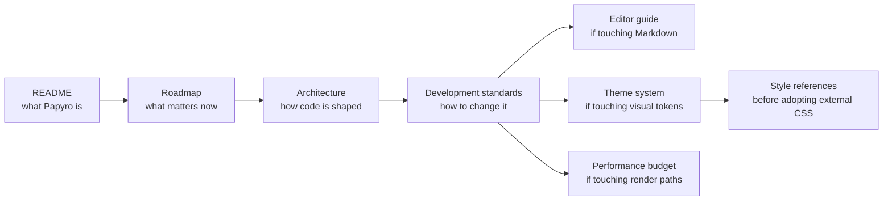

# Papyro Documentation

[简体中文](zh-CN/README.md) | [Repository README](../README.md)

This directory is intentionally small. Older phase notes, duplicated design drafts, and one-off investigation documents were consolidated into the guides below so new contributors can find the current truth quickly.

## Start Here

| Need | Read |
| --- | --- |
| Understand the product | [Roadmap](roadmap.md) |
| Understand the codebase | [Architecture](architecture.md) |
| Start coding safely | [Development standards](development-standards.md) |
| Work on Markdown editing | [Editor guide](editor.md) |
| Change themes or Markdown styles | [Theme system](theme-system.md) |
| Choose Markdown style references | [Markdown style references](markdown-style-references.md) |
| Keep interactions fast | [Performance budget](performance-budget.md) |
| Use AI helpers | [AI skills](ai-skills.md) |

## Recommended Path For New Contributors

If you are unsure where a change belongs:

- UI layout or controls: `crates/ui`
- User flow, state mutation, side effects: `crates/app`
- Pure models or rules: `crates/core`
- SQLite, filesystem, workspace scan, watcher: `crates/storage`
- Platform dialogs and shell integration: `crates/platform`
- Markdown summary, render, protocol structs: `crates/editor`
- CodeMirror runtime behavior: `js/src/editor.js` or `js/src/editor-core.js`
- Theme tokens or Markdown visual language: `assets/main.css`, `apps/*/assets/main.css`, and [theme-system.md](theme-system.md)

## Documentation Maintenance Rules

- Keep README visitor-friendly. Do not turn it into an internal design dump.
- Keep architecture current with code. If a module moves, update [architecture.md](architecture.md).
- Keep roadmap product-facing and actionable. Avoid historical diary entries.
- Keep performance trace names in both [performance-budget.md](performance-budget.md) and [roadmap.md](roadmap.md). CI checks this.
- Keep Chinese docs aligned with the English docs when changing contributor-facing behavior.
