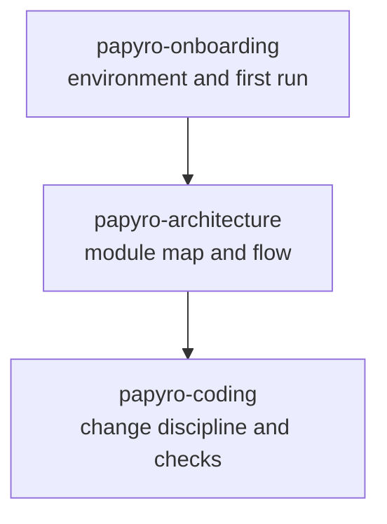

# AI Skills

[简体中文](zh-CN/ai-skills.md) | [Documentation](README.md)

The `skills/` directory contains project-local instructions for AI coding agents. These files are intentionally short and task-focused so an agent can load the right context without rereading the entire repository.

## Available Skills

| Skill | Use when |
| --- | --- |
| `papyro-onboarding` | setting up the project, installing tools, running first checks |
| `papyro-architecture` | deciding where code belongs or understanding data flow |
| `papyro-coding` | implementing a scoped change and validating it correctly |

## Skill Map

## How AI Agents Should Use Them

1. Load only the skill that matches the task.
2. Follow links from the skill to the exact docs needed.
3. Avoid rereading broad historical documents.
4. Keep changes within the module boundary described by the skill.
5. Run the validation commands named by the skill.

## Why This Exists

Papyro has several layers: platform shells, application runtime, pure core state, UI, storage, editor helpers, and JS editor runtime. Without a project-specific map, AI agents tend to spend too many tokens rediscovering the same boundaries or changing the wrong layer.

Skills make common tasks cheaper:

- a new contributor can install and run the app quickly
- a coding agent can identify the right crate faster
- reviews can point to a shared standard instead of repeating rules
- generated context stays focused on the current task

## Maintenance

Update skills when:

- a crate boundary changes
- validation commands change
- editor source/generation rules change
- the roadmap changes the main development priority
- onboarding instructions change
