# Papyro 架构设计新手导览

这份文档写给第一次接触 Papyro 的开发者。

它不假设你已经熟悉 Rust workspace、Dioxus、SQLite、CodeMirror 或大型前端状态管理。目标是让你知道：

- 这个项目为什么这样拆目录。
- 程序从启动到显示界面经历了什么。
- 用户点一个按钮之后，数据会经过哪些模块。
- 想改某个功能时，应该先看哪一层代码。
- 哪些边界不能随便打破。

如果你只想看最短版，可以先读 [architecture.md](architecture.md)。如果你想真正理解项目怎么运转，建议按本文顺序读。

## 1. 先用一句话理解 Papyro

Papyro 是一个基于 Rust 和 Dioxus 0.7 的跨端 Markdown 笔记软件。

它的核心目标是：

- 用户自己的 `.md` 文件是一等公民。
- 桌面端和移动端共用大部分业务逻辑。
- UI 用 Dioxus 写，编辑器运行时用 CodeMirror 6 写。
- 文件内容存放在本地 Markdown 文件中。
- 元数据、最近打开、标签、设置等信息存放在 SQLite 中。

你可以把它理解成三件事的组合：

```text
本地 Markdown 文件
    + SQLite 元数据
    + Dioxus/CodeMirror 编辑体验
```

用图看会更直观：

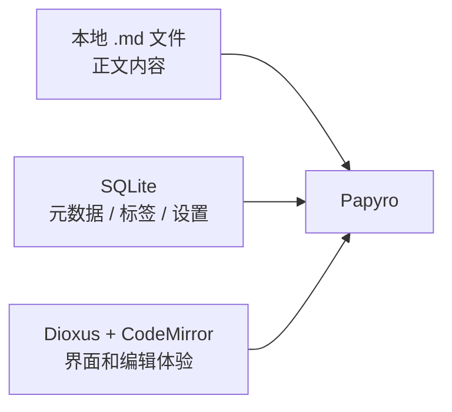

## 2. 新手先认识几个词

### Workspace

Workspace 是用户打开的一个笔记文件夹。

例如：

```text
E:\notes
├─ daily.md
├─ project.md
└─ assets/
   └─ image.png
```

Papyro 会扫描这个文件夹里的 Markdown 文件，生成侧边栏文件树。

### Note

Note 是一个 Markdown 文件。比如 `daily.md`。

注意：Papyro 的正文内容仍然写回 `.md` 文件，不会只藏在数据库里。

### Tab

Tab 是编辑器里打开的一篇笔记。

一个 Note 在文件系统里是一份文件，一个 Tab 是界面里正在编辑它的会话。

### Crate

Rust 里的 crate 可以粗略理解成“一个独立模块包”。

Papyro 不是一个大 `src/main.rs` 文件，而是一个 Cargo workspace，里面有多个 crate：

```text
apps/desktop
apps/mobile
crates/app
crates/core
crates/ui
crates/storage
crates/platform
crates/editor
```

### Shell

Shell 指平台宿主壳。

`apps/desktop` 是桌面端 shell，负责开窗口、注入 CSS/JS、启动 Dioxus desktop。

`apps/mobile` 是移动端 shell，负责移动端入口和资源。

Shell 不应该承载核心业务逻辑。

### Runtime

Runtime 是应用运行时。

它负责创建状态、注入 context、组装命令、挂 watcher、连接 storage/platform/ui/editor。

当前 runtime 的核心在 [crates/app/src/runtime.rs](../crates/app/src/runtime.rs)。

### Signal

Signal 是 Dioxus 0.7 的响应式状态容器。

简单说，组件读了某个 signal，当 signal 更新时，相关 UI 会重新渲染。

最小例子：

```rust
use dioxus::prelude::*;

#[component]
fn Counter() -> Element {
    let mut count = use_signal(|| 0);

    rsx! {
        button {
            onclick: move |_| *count.write() += 1,
            "Count: {count}"
        }
    }
}
```

这个例子里：

- `use_signal(|| 0)` 创建本组件自己的状态。
- `count` 被显示在 RSX 中，所以 UI 会订阅它。
- `count.write()` 修改状态后，按钮文本会更新。

项目里必须使用 Dioxus 0.7 风格。不要使用旧 API：`cx`、`Scope`、`use_state`。

## 3. 总体架构图

先看最重要的一张图：

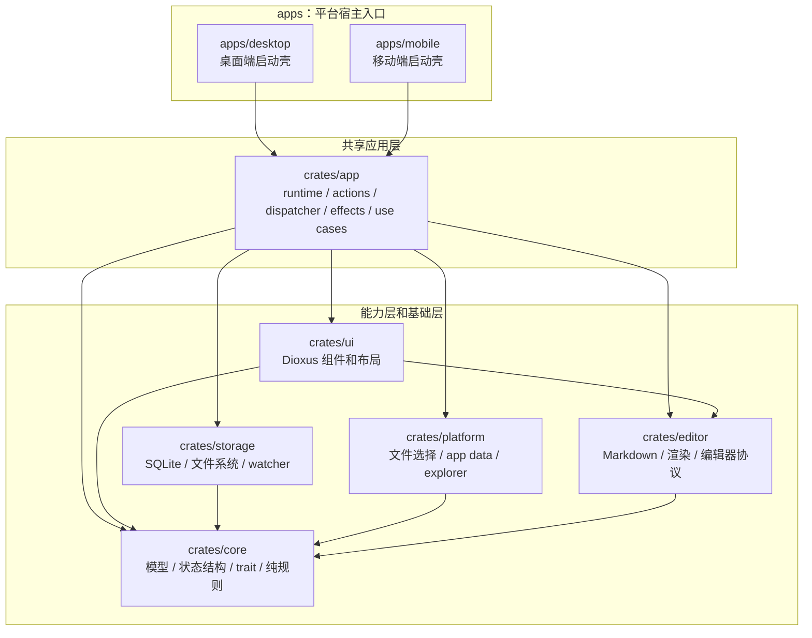

这张图表达的是“谁可以依赖谁”。

最上面是宿主入口。中间是共享应用层。下面是 UI、核心模型、存储、平台、编辑器能力。

## 4. 每层到底负责什么

### 4.1 `apps/desktop`：桌面端启动壳

核心文件：

- [apps/desktop/src/main.rs](../apps/desktop/src/main.rs)
- [apps/desktop/Cargo.toml](../apps/desktop/Cargo.toml)

它负责：

- 初始化日志。
- 同步 desktop 需要的 `editor.js` 资源。
- 构造桌面窗口大小、标题、最小尺寸。
- 注入 favicon、CSS、编辑器 JS。
- 调用 Dioxus desktop 启动应用。
- 挂载 `papyro_app::desktop::DesktopApp`。

它不负责：

- 打开笔记的业务流程。
- 保存文件的业务流程。
- 创建、删除、重命名文件。
- UI 组件内部实现。
- SQLite 或文件扫描细节。

简化后的启动代码可以这样理解：

```rust
use dioxus::prelude::*;

fn main() {
    dioxus::LaunchBuilder::new()
        .with_cfg(/* desktop window config */)
        .launch(papyro_app::desktop::DesktopApp);
}
```

真实代码里还多了资源注入、窗口配置和性能日志。

### 4.2 `apps/mobile`：移动端启动壳

核心文件：

- [apps/mobile/src/main.rs](../apps/mobile/src/main.rs)
- [apps/mobile/Cargo.toml](../apps/mobile/Cargo.toml)

它负责：

- 初始化移动端入口。
- 注入移动端静态资源。
- 挂载 `papyro_app::mobile::MobileApp`。

它不应该直接复用 desktop 源码路径。跨端共享逻辑统一进入 `crates/app`。

### 4.3 `crates/app`：共享应用层

核心文件和目录：

- [crates/app/src/runtime.rs](../crates/app/src/runtime.rs)
- [crates/app/src/state.rs](../crates/app/src/state.rs)
- [crates/app/src/actions.rs](../crates/app/src/actions.rs)
- [crates/app/src/dispatcher.rs](../crates/app/src/dispatcher.rs)
- [crates/app/src/effects.rs](../crates/app/src/effects.rs)
- [crates/app/src/handlers](../crates/app/src/handlers)
- [crates/app/src/workspace_flow.rs](../crates/app/src/workspace_flow.rs)
- [crates/app/src/workspace_flow](../crates/app/src/workspace_flow)
- [crates/app/src/desktop.rs](../crates/app/src/desktop.rs)
- [crates/app/src/mobile.rs](../crates/app/src/mobile.rs)

这是当前最重要的一层。

你可以把 `crates/app` 理解成“应用总调度室”。

它负责：

- 创建运行时状态。
- 创建 storage 和 platform 的连接。
- 把状态和命令注入 Dioxus context。
- 把 UI 的命令转换成应用动作。
- 调用具体 handler。
- 调用 workspace flow 完成业务流程。
- 管理 autosave、文件 watcher、关闭前保存等副作用。

它不应该负责：

- 具体 UI 长什么样。
- SQLite 表怎么写。
- CodeMirror 内部怎么装饰 Markdown。
- 平台文件选择器具体怎么弹。

`crates/app` 内部可以按这条线理解：

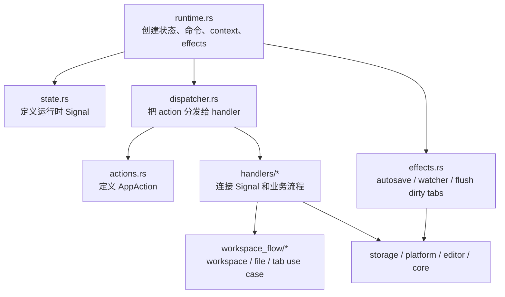

一个简化版的 `DesktopApp` 是这样：

```rust
#[component]
pub fn DesktopApp() -> Element {
    let bootstrap = papyro_storage::bootstrap_from_env_or_current_dir();
    let storage = use_hook(|| Arc::new(papyro_storage::SqliteStorage::shared().unwrap()));
    let platform = use_hook(|| Arc::new(DesktopPlatform));

    let status_message = use_app_runtime(
        AppShell::Desktop,
        bootstrap,
        storage,
        platform,
    );

    rsx! {
        papyro_ui::layouts::DesktopLayout {
            status_message: status_message(),
        }
    }
}
```

这段的意思是：

- `DesktopApp` 不是直接写业务。
- 它准备好 bootstrap、storage、platform。
- 然后交给 `use_app_runtime`。
- 最后渲染 UI layout。

### 4.4 `crates/core`：核心模型和纯规则

核心文件：

- [crates/core/src/models.rs](../crates/core/src/models.rs)
- [crates/core/src/storage.rs](../crates/core/src/storage.rs)
- [crates/core/src/file_state.rs](../crates/core/src/file_state.rs)
- [crates/core/src/editor_state.rs](../crates/core/src/editor_state.rs)
- [crates/core/src/ui_state.rs](../crates/core/src/ui_state.rs)
- [crates/core/src/editor_service.rs](../crates/core/src/editor_service.rs)

`core` 是更底层、更稳定的一层。

它负责：

- 数据模型，比如 `Workspace`、`FileNode`、`EditorTab`、`AppSettings`。
- 纯状态结构，比如 `FileState`、`EditorTabs`、`TabContentsMap`、`UiState`。
- 存储 trait，比如 `NoteStorage`。
- 不依赖具体平台和 UI 装配的纯规则。

它不应该负责：

- 启动 Dioxus 应用。
- 弹文件选择器。
- 打开系统资源管理器。
- 直接修改 Dioxus signal。
- 管理 watcher 生命周期。

一个很关键的点：`core` 定义接口，但不关心接口怎么实现。

例如 [crates/core/src/storage.rs](../crates/core/src/storage.rs) 里定义了 `NoteStorage`：

```rust
pub trait NoteStorage: Send + Sync {
    fn open_note(&self, workspace: &Workspace, path: &Path) -> Result<OpenedNote>;
    fn save_note(&self, workspace: &Workspace, tab: &EditorTab, content: &str)
        -> Result<SavedNote>;
    fn initialize_workspace(&self, root: &Path) -> Result<WorkspaceSnapshot>;
}
```

这表示应用层只需要知道“我能打开笔记、保存笔记、初始化 workspace”。

至于底层是 SQLite、文件系统，还是以后换成别的存储，`core` 不关心。

### 4.5 `crates/ui`：Dioxus UI 层

核心文件和目录：

- [crates/ui/src/context.rs](../crates/ui/src/context.rs)
- [crates/ui/src/commands.rs](../crates/ui/src/commands.rs)
- [crates/ui/src/view_model.rs](../crates/ui/src/view_model.rs)
- [crates/ui/src/layouts](../crates/ui/src/layouts)
- [crates/ui/src/components](../crates/ui/src/components)
- [crates/ui/src/chrome.rs](../crates/ui/src/chrome.rs)
- [crates/ui/src/theme](../crates/ui/src/theme)

UI 层负责：

- 桌面布局 `DesktopLayout`。
- 移动布局 `MobileLayout`。
- Header、Sidebar、EditorPane、Settings、Search、Quick Open 等组件。
- UI 命令类型 `AppCommands`。
- UI 可消费的 view model。
- 通过 `AppContext` 读取状态和调用命令。

UI 层不应该：

- 直接操作 SQLite。
- 直接扫描文件系统。
- 绕过 `AppCommands` 调业务流程。
- 把业务真相藏在组件内部。

目前 UI 通过 [crates/ui/src/context.rs](../crates/ui/src/context.rs) 使用统一入口：

```rust
pub fn use_app_context() -> AppContext {
    use_context::<AppContext>()
}
```

组件一般会这样取上下文：

```rust
#[component]
fn SomeButton() -> Element {
    let app = use_app_context();
    let commands = app.commands;

    rsx! {
        button {
            onclick: move |_| commands.save_active_note.call(()),
            "Save"
        }
    }
}
```

这段表达的架构原则是：

- UI 只表达“用户想保存”。
- 保存怎么做由 `crates/app` 决定。
- UI 不直接调用 storage。

### 4.6 `crates/storage`：存储实现层

核心文件和目录：

- [crates/storage/src/lib.rs](../crates/storage/src/lib.rs)
- [crates/storage/src/db](../crates/storage/src/db)
- [crates/storage/src/fs](../crates/storage/src/fs)
- [crates/storage/src/index](../crates/storage/src/index)

存储层负责：

- SQLite 连接池。
- 数据库迁移。
- 工作空间记录。
- 笔记元数据。
- 标签。
- 最近打开。
- 设置。
- `.md` 文件读写。
- workspace 扫描。
- 文件 watcher。
- 回收站 `.papyro-trash/`。
- 搜索扫描。

它实现了 `crates/core` 里定义的 `NoteStorage` trait。

这是一种很常见的设计：

```text
core 定义“需要什么能力”
storage 提供“这些能力怎么落地”
app 调用“这些能力”
ui 不直接碰 storage
```

Papyro 的存储设计可以概括为“双轨存储”：

```text
.md 文件
  保存正文内容，兼容普通 Markdown 工具

SQLite
  保存元数据、标签、最近打开、workspace、设置、索引信息
```

这能避免把用户的笔记锁死在私有格式里。

### 4.7 `crates/platform`：平台能力适配层

核心文件：

- [crates/platform/src/traits.rs](../crates/platform/src/traits.rs)
- [crates/platform/src/desktop.rs](../crates/platform/src/desktop.rs)
- [crates/platform/src/mobile.rs](../crates/platform/src/mobile.rs)

平台层负责：

- 选择文件夹。
- 选择文件。
- 打开系统资源管理器。
- 获取 app data 目录。
- desktop 和 mobile 的不同实现。

核心接口是 `PlatformApi`：

```rust
#[async_trait]
pub trait PlatformApi: Send + Sync {
    async fn pick_folder(&self) -> Result<Option<PathBuf>>;
    async fn pick_file(&self, filters: &[(&str, &[&str])]) -> Result<Option<PathBuf>>;
    fn open_in_explorer(&self, path: &Path) -> Result<()>;
    fn get_app_data_dir(&self) -> Result<PathBuf>;
}
```

为什么要抽象这一层？

因为桌面端和移动端选择文件、打开目录、获取数据目录的方式不同。

应用层只关心“我要选一个文件夹”，不关心 Windows、macOS、Android 或 iOS 的具体 API。

### 4.8 `crates/editor`：Markdown 和编辑器协议层

核心文件和目录：

- [crates/editor/src/parser](../crates/editor/src/parser)
- [crates/editor/src/renderer](../crates/editor/src/renderer)
- [crates/editor/src/protocol.rs](../crates/editor/src/protocol.rs)
- [docs/editor-protocol.md](editor-protocol.md)

它负责：

- Markdown 统计，比如字数、字符数、标题数。
- Markdown 渲染成 HTML。
- Rust 和 JS 编辑器之间的协议类型。
- 编辑器相关的纯能力。

它不应该负责：

- 直接保存文件。
- 直接修改 Dioxus signal。
- 决定 UI 布局。
- 控制系统平台能力。

### 4.9 `js/`：CodeMirror 编辑器运行时源码

核心文件：

- [js/src/editor.js](../js/src/editor.js)
- [js/src/editor-core.js](../js/src/editor-core.js)
- [js/build.js](../js/build.js)
- [js/test/editor-core.test.js](../js/test/editor-core.test.js)

Papyro 的真正文本编辑器运行时是 CodeMirror 6。

Rust/Dioxus 负责应用状态和 UI 外壳。JS/CodeMirror 负责浏览器里的编辑能力：

- 输入。
- 光标。
- 选区。
- 快捷键。
- Markdown 装饰。
- 粘贴和拖拽图片。
- 编辑器布局测量。

修改 JS 后需要构建：

```bash
cd js
npm install
npm run build
```

构建会同步生成：

- [assets/editor.js](../assets/editor.js)
- [apps/desktop/assets/editor.js](../apps/desktop/assets/editor.js)
- [apps/mobile/assets/editor.js](../apps/mobile/assets/editor.js)

日常只应该改 `js/src/editor.js` 和 `js/src/editor-core.js`，不要手动改生成出来的 `editor.js` 副本。

## 5. 启动链路

### 5.1 Desktop 启动链路

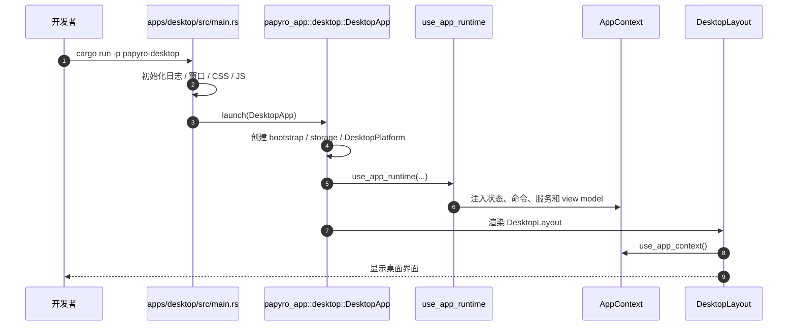

逐步解释：

1. `apps/desktop/src/main.rs` 是进程入口。
2. 它配置窗口、CSS、JS、favicon。
3. 它调用 `LaunchBuilder.launch(DesktopApp)`。
4. `DesktopApp` 创建 storage 和 platform。
5. `DesktopApp` 调用 `use_app_runtime`。
6. `use_app_runtime` 创建所有 signal 状态。
7. `use_app_runtime` 创建 dispatcher 和 commands。
8. `use_app_runtime` 把 `AppContext` 注入 Dioxus。
9. `DesktopLayout` 通过 `use_app_context()` 读取状态和命令。
10. UI 开始显示。

### 5.2 Mobile 启动链路

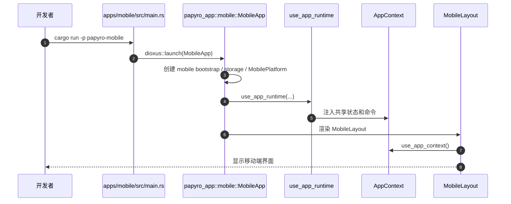

移动端和桌面端的核心区别是：

- 使用 `MobilePlatform`。
- 使用 `MobileLayout`。
- 移动端暂时有一些功能不可用，比如 HTML export。

业务主链路仍然通过 `crates/app` 共享。

## 6. 运行时状态怎么组织

`crates/app/src/state.rs` 定义了 `RuntimeState`。

它不是一个巨大的全局结构体，而是多个 Signal：

```rust
pub(crate) struct RuntimeState {
    pub file_state: Signal<FileState>,
    pub editor_tabs: Signal<EditorTabs>,
    pub tab_contents: Signal<TabContentsMap>,
    pub ui_state: Signal<UiState>,
    pub workspace_search: Signal<WorkspaceSearchState>,
    pub status_message: Signal<Option<String>>,
    pub workspace_watch_path: Signal<Option<PathBuf>>,
    pub pending_close_tab: Signal<Option<String>>,
    pub pending_delete_path: Signal<Option<PathBuf>>,
    pub pending_empty_trash: Signal<bool>,
}
```

这些状态可以按领域理解。

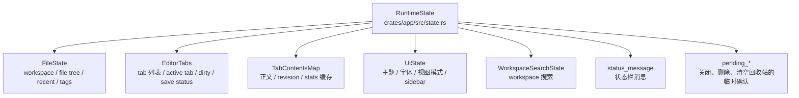

### 6.1 `FileState`

定义在 [crates/core/src/file_state.rs](../crates/core/src/file_state.rs)。

它关心 workspace 和文件树：

- 当前 workspace。
- 最近 workspace。
- 文件树。
- 展开的目录。
- 最近打开文件。
- 回收站笔记。
- 标签。
- 当前选中的路径。

### 6.2 `EditorTabs`

定义在 [crates/core/src/editor_state.rs](../crates/core/src/editor_state.rs)。

它关心 tab 列表：

- 打开了哪些 tab。
- 当前激活哪个 tab。
- tab 是否 dirty。
- tab 保存状态。

### 6.3 `TabContentsMap`

也定义在 [crates/core/src/editor_state.rs](../crates/core/src/editor_state.rs)。

它关心 tab 的正文内容和派生数据：

- `tab_id -> markdown content`
- `tab_id -> revision`
- `tab_id -> stats`

为什么不把内容直接塞进 `EditorTab`？

因为 tab 元信息和正文内容的更新频率不一样。

用户输入时，正文会高频变化。如果所有东西都绑在一个大结构里，很容易让 UI 大面积重渲染。

拆开后可以更细地控制：

```text
EditorTabs
  tab 标题、dirty 状态、active tab

TabContentsMap
  正文内容、revision、统计缓存
```

### 6.4 `UiState`

定义在 [crates/core/src/ui_state.rs](../crates/core/src/ui_state.rs)。

它关心 UI 偏好：

- 主题。
- 字体。
- 字号。
- 行高。
- 自动保存延迟。
- 侧边栏宽度和折叠状态。
- 编辑器模式 Source / Hybrid / Preview。
- 大纲是否可见。

它还会合并全局设置和 workspace 单独设置。

### 6.5 ViewModel

定义在 [crates/ui/src/view_model.rs](../crates/ui/src/view_model.rs)。

它的作用是把底层状态整理成 UI 更容易消费的数据。

例如：

- `WorkspaceViewModel`
- `EditorViewModel`
- `EditorSurfaceViewModel`
- `SettingsViewModel`，目前主要作为纯派生模型和测试参照，运行时 context 更偏向使用窄 memo。

这样做的目的不是多写一层，而是减少 UI 直接读取一堆 raw signal 的机会。

一个好处是：侧边栏只关心 workspace 数据时，编辑器内容变化不应该影响侧边栏。

## 7. 命令和数据流

这是 Papyro 最重要的运行路径：


### 7.1 UI 层发出命令

UI 不直接调用业务函数，而是调用 `AppCommands`。

例子：

```rust
let app = use_app_context();
let commands = app.commands;

rsx! {
    button {
        onclick: move |_| commands.save_active_note.call(()),
        "Save"
    }
}
```

这表示用户点击保存按钮。按钮并不知道怎么保存，只知道发出保存命令。

### 7.2 `AppCommands` 转成 `AppAction`

`AppCommands` 定义在 [crates/ui/src/commands.rs](../crates/ui/src/commands.rs)。

`AppAction` 定义在 [crates/app/src/actions.rs](../crates/app/src/actions.rs)。

例如：

```rust
pub enum AppAction {
    OpenWorkspace,
    CreateNote(CreateNote),
    OpenNote(OpenNote),
    ContentChanged(ContentChange),
    SaveActiveNote,
    CloseTab(CloseTab),
}
```

`AppAction` 是应用层能理解的动作列表。

### 7.3 Dispatcher 决定交给谁处理

[crates/app/src/dispatcher.rs](../crates/app/src/dispatcher.rs) 里有一个大 `match`。

简化理解：

```rust
match action {
    AppAction::OpenWorkspace => workspace::open_workspace(...),
    AppAction::OpenNote(action) => notes::open_note(...),
    AppAction::SaveActiveNote => notes::save_active_note(...),
    AppAction::ContentChanged(action) => effects::record_content_change(...),
}
```

Dispatcher 像一个路由表：

- 打开 workspace 交给 workspace handler。
- 打开笔记交给 notes handler。
- 输入变化交给 effects。
- 文件操作交给 file_ops handler。

### 7.4 Handler 连接 Signal 和业务流程

handler 位于 [crates/app/src/handlers](../crates/app/src/handlers)。

它们负责把 Dioxus Signal 世界和普通 Rust 业务函数接起来。

例如打开笔记：

```text
notes::open_note
-> notes::open_note_path
-> spawn_blocking
-> workspace_flow::open_note_from_storage
-> storage.open_note
-> core::open_note 更新 tab 结构
-> 回到 UI 线程 set Signal
```

为什么很多地方用 `spawn_blocking`？

因为文件系统和 SQLite 操作可能阻塞线程。把它们放到 blocking task 中，可以减少 UI 卡顿。

### 7.5 Workspace Flow 承载业务用例

`workspace_flow` 位于：

- [crates/app/src/workspace_flow.rs](../crates/app/src/workspace_flow.rs)
- [crates/app/src/workspace_flow](../crates/app/src/workspace_flow)

它负责更具体的业务编排：

- 创建笔记。
- 创建文件夹。
- 打开笔记。
- 打开最近文件。
- 刷新 workspace。
- 保存 tab。
- 重命名。
- 移动。
- 删除和恢复。

你可以把 `handlers` 和 `workspace_flow` 的区别理解成：

```text
handlers
  和 Dioxus Signal 打交道

workspace_flow
  和具体业务步骤打交道
```

## 8. 几条典型用户路径

### 8.1 打开 workspace

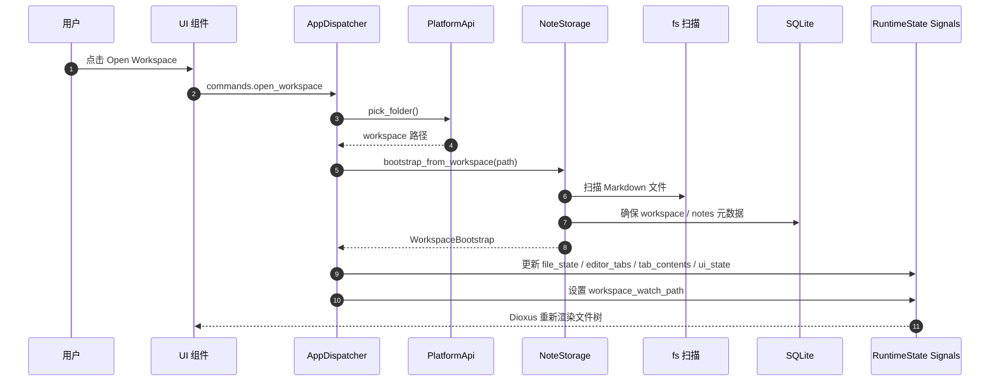

关键代码：

- [crates/app/src/handlers/workspace.rs](../crates/app/src/handlers/workspace.rs)
- [crates/storage/src/lib.rs](../crates/storage/src/lib.rs)
- [crates/storage/src/fs/workspace.rs](../crates/storage/src/fs/workspace.rs)

### 8.2 打开一篇笔记

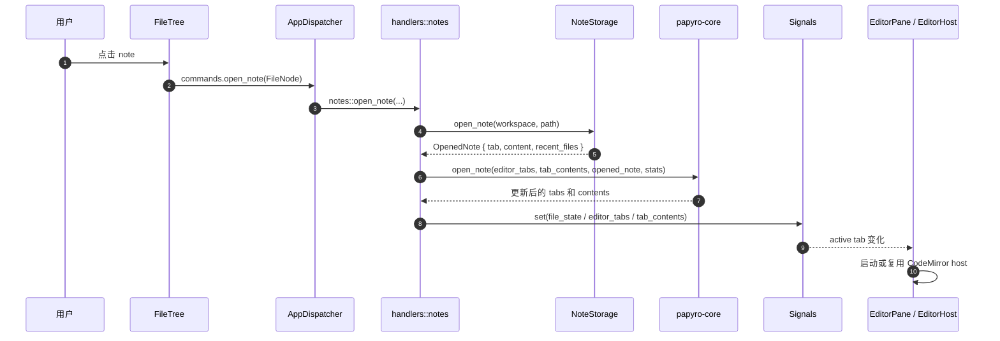

关键代码：

- [crates/app/src/handlers/notes.rs](../crates/app/src/handlers/notes.rs)
- [crates/app/src/workspace_flow/open.rs](../crates/app/src/workspace_flow/open.rs)
- [crates/core/src/editor_service.rs](../crates/core/src/editor_service.rs)
- [crates/ui/src/components/editor/pane.rs](../crates/ui/src/components/editor/pane.rs)

### 8.3 输入内容和自动保存

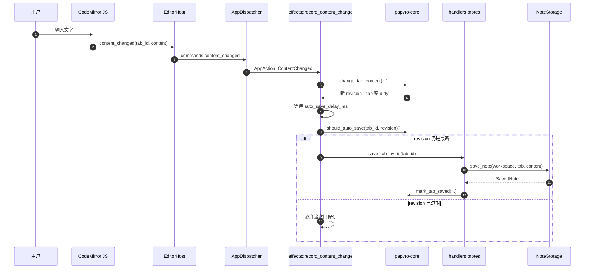

关键代码：

- [crates/ui/src/components/editor/host.rs](../crates/ui/src/components/editor/host.rs)
- [crates/app/src/effects.rs](../crates/app/src/effects.rs)
- [crates/app/src/handlers/notes.rs](../crates/app/src/handlers/notes.rs)
- [crates/storage/src/lib.rs](../crates/storage/src/lib.rs)

这里的 revision 很重要。

它用于避免这种问题：

```text
第 1 次输入触发自动保存计时
第 2 次输入又修改了内容
第 1 次计时结束时发现 revision 已过期
于是放弃旧保存
只保存最新内容
```

### 8.4 手动保存

```text
用户按 Ctrl/Cmd + S 或点击保存
-> commands.save_active_note
-> dispatcher 收到 AppAction::SaveActiveNote
-> notes::save_active_note
-> notes::save_tab_by_id
-> workspace_flow::begin_save_tab
-> storage.save_note
-> apply_save_success 或 apply_save_failure
```

保存成功：

- dirty 变成 false。
- save_status 变成 Saved。
- tab 记录新的磁盘内容 hash，作为下一次保存前的冲突检测基线。
- 标题可能根据 Markdown H1 更新。
- recent files 刷新。

保存失败：

- dirty 保持 true。
- save_status 变成 Failed。
- status bar 显示错误。

保存冲突：

- storage 在写入前读取磁盘内容并比较 tab 中记录的内容 hash。
- 如果磁盘内容已经变化，不写文件。
- dirty 保持 true。
- save_status 变成 Conflict。
- 内存里的用户编辑内容保留，后续需要 reload、overwrite 或 save as 策略来解决。

### 8.5 关闭 tab

```text
用户关闭 tab
-> commands.close_tab
-> dispatcher close_tab
-> 如果 tab dirty 且未二次确认
   -> 先尝试保存
   -> 设置 pending_close_tab
   -> 提示用户再点一次才丢弃
-> 如果确认关闭
   -> EditorTabs 移除 tab
   -> TabContentsMap 移除正文
   -> 延迟销毁 JS editor bridge
```

关键代码：

- [crates/app/src/dispatcher.rs](../crates/app/src/dispatcher.rs)
- [crates/ui/src/components/editor/bridge.rs](../crates/ui/src/components/editor/bridge.rs)

### 8.6 外部文件变化

```text
外部工具创建、修改、删除、重命名文件
-> storage/fs watcher 发送 WatchEvent
-> effects::use_workspace_watcher 接收
-> 判断是否属于当前 workspace
-> 合并多余事件
-> reload workspace tree
-> 如果影响已打开 tab，显示提示
```

关键代码：

- [crates/app/src/effects.rs](../crates/app/src/effects.rs)
- [crates/app/src/handlers/workspace.rs](../crates/app/src/handlers/workspace.rs)
- [crates/storage/src/fs/watcher.rs](../crates/storage/src/fs/watcher.rs)

## 9. 编辑器架构

Papyro 的编辑器不是纯 Rust，也不是纯 JS，而是分工协作。

```mermaid
flowchart LR
    rust["Rust / Dioxus<br/>状态、tab、保存、文件、UI 容器"]
    protocol["crates/editor/protocol.rs<br/>EditorCommand / EditorEvent"]
    js["JS / CodeMirror<br/>输入、选区、快捷键、Markdown 装饰"]

    rust -->|EditorCommand JSON| protocol
    protocol -->|handleRustMessage(...)| js
    js -->|dioxus.send(EditorEvent)| protocol
    protocol -->|反序列化事件| rust
```

### 9.1 Rust 侧组件

主要文件：

- [crates/ui/src/components/editor/pane.rs](../crates/ui/src/components/editor/pane.rs)
- [crates/ui/src/components/editor/host.rs](../crates/ui/src/components/editor/host.rs)
- [crates/ui/src/components/editor/bridge.rs](../crates/ui/src/components/editor/bridge.rs)
- [crates/ui/src/components/editor/preview.rs](../crates/ui/src/components/editor/preview.rs)
- [crates/ui/src/components/editor/outline.rs](../crates/ui/src/components/editor/outline.rs)
- [crates/ui/src/components/editor/document_cache.rs](../crates/ui/src/components/editor/document_cache.rs)

`EditorPane` 负责：

- 渲染 tabbar。
- 渲染 Source / Hybrid / Preview 切换。
- 维护每个 tab 对应的 `EditorHost`。
- 显示 preview 和 outline。
- 管理派生缓存。

`EditorHost` 负责：

- 给 JS 编辑器准备 DOM 容器。
- 通过 `document::eval` 启动 JS。
- 接收 JS 事件。
- 向 JS 发送命令。
- 在 JS 加载失败时显示 fallback editor。

`bridge.rs` 负责：

- 保存 Rust 到 JS 的 eval channel。
- 延迟发送 destroy。
- 防止旧 host 销毁新 host。

### 9.2 Rust 到 JS 的命令

协议定义在 [crates/editor/src/protocol.rs](../crates/editor/src/protocol.rs)。

典型命令：

```text
SetContent
SetViewMode
SetPreferences
ApplyFormat
InsertMarkdown
Focus
Destroy
```

例如切换编辑模式时：

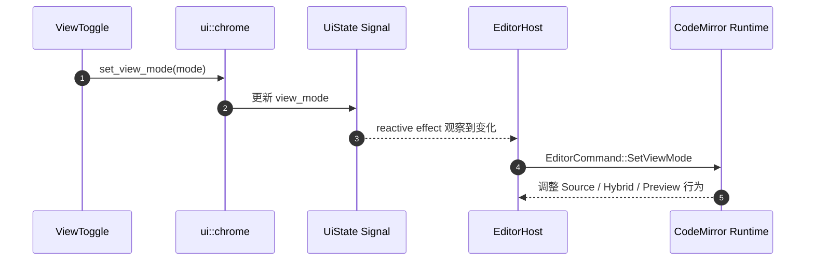

### 9.3 JS 到 Rust 的事件

典型事件：

```text
RuntimeReady
RuntimeError
ContentChanged
SaveRequested
PasteImageRequested
```

例如输入时：

```text
CodeMirror updateListener
-> dioxus.send({ type: "content_changed", ... })
-> Rust 反序列化成 EditorEvent::ContentChanged
-> commands.content_changed
```

关键规则：

- JS 不直接写文件。
- JS 只能告诉 Rust“内容变了”或“请求保存”。
- Rust 才是文档内容、保存状态、tab 状态的真相来源。
- `set_content` 不应该回声触发 `content_changed`。
- CodeMirror layout refresh 不再经过 Rust 事件或命令，由 JS runtime 的 `ResizeObserver` 本地处理。

这些规则也写在 [docs/editor-protocol.md](editor-protocol.md)。

### 9.4 三种编辑模式

`ViewMode` 定义在 [crates/core/src/models.rs](../crates/core/src/models.rs)：

```rust
pub enum ViewMode {
    Hybrid,
    Source,
    Preview,
}
```

含义：

- `Source`：更接近原始 Markdown 编辑。
- `Hybrid`：类似 Typora，尽量所见即所得，但仍在编辑 Markdown。
- `Preview`：只看渲染结果。

`ViewMode::is_editable()` 决定当前模式是否需要显示可编辑的 CodeMirror host。

## 10. 存储和数据模型

Papyro 的数据分两类。

### 10.1 Markdown 文件

正文内容直接保存在用户 workspace 下的 `.md` 文件里。

好处：

- 用户可以用别的 Markdown 工具打开。
- Git 可以直接管理。
- 不依赖 Papyro 私有格式。

### 10.2 SQLite 数据库

SQLite 存放：

- workspace 列表。
- note 元数据。
- recent files。
- tags。
- settings。
- workspace tree state。
- trashed note metadata。

数据库路径由 storage/platform 决定，通常在 app data 目录下。

可以把“双轨存储”看成这张图：

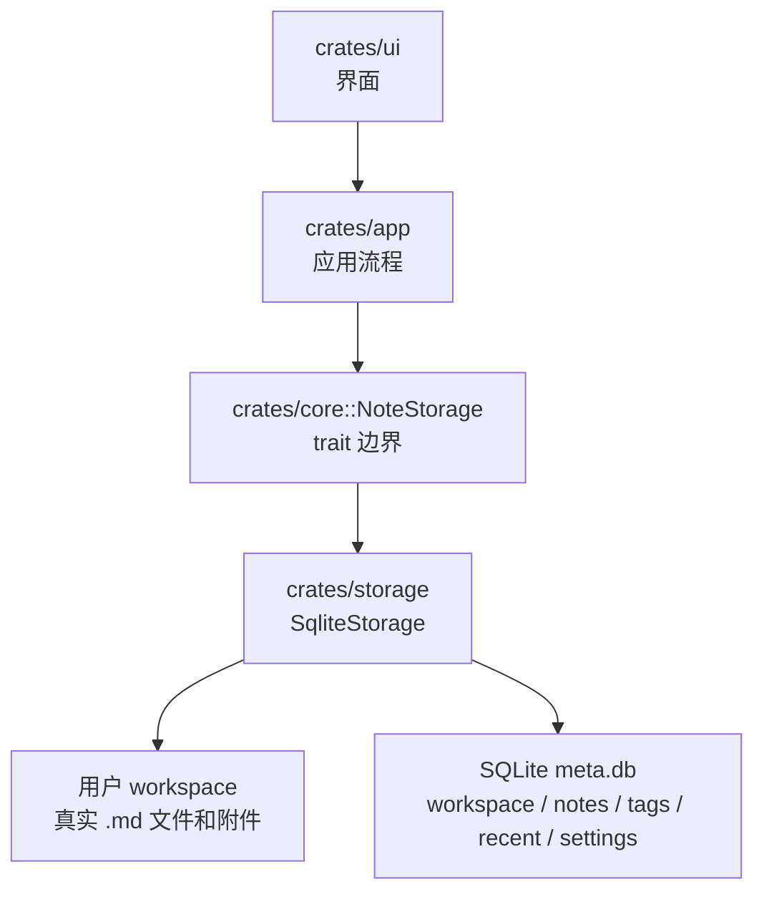

如果用实体关系图粗略表示 SQLite 里的核心关系，可以这样看：

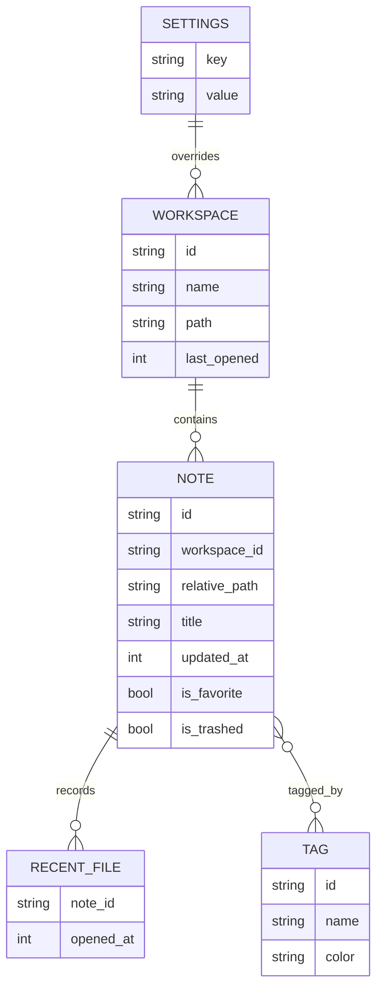

### 10.3 设置合并

设置有两层：

```text
global settings
  全局默认设置

workspace overrides
  当前 workspace 对全局设置的覆盖
```

最终 UI 使用的是合并结果：

```rust
let effective = global_settings.with_workspace_overrides(&workspace_overrides);
```

这样可以做到：

- 全局默认字体和主题。
- 某个 workspace 单独改主题或字号。

### 10.4 删除和回收站

当前删除策略是移动到 workspace 下的 `.papyro-trash/`。

相关能力在 storage 和 app flow 中：

- 删除前预览孤立附件。
- 移动到 trash。
- 列出 trashed notes。
- 恢复 trashed note。
- 清空 trash。

## 11. 依赖边界

这部分很重要。项目能长期维护，靠的就是边界清楚。

允许：

```text
apps/* -> crates/app
crates/app -> crates/ui
crates/app -> crates/core
crates/app -> crates/storage
crates/app -> crates/platform
crates/app -> crates/editor
crates/ui -> crates/core
crates/ui -> crates/editor
crates/storage -> crates/core
crates/platform -> crates/core
crates/editor -> crates/core
```

不应该做：

```text
apps/desktop 里写打开笔记流程
apps/mobile 通过路径复用 desktop 源码
crates/ui 直接依赖 papyro-storage
crates/storage 直接修改 Dioxus Signal
crates/core 调用 Dioxus runtime
JS 编辑器直接写文件
```

用图看，红线方向就是应该避免的跨层调用：

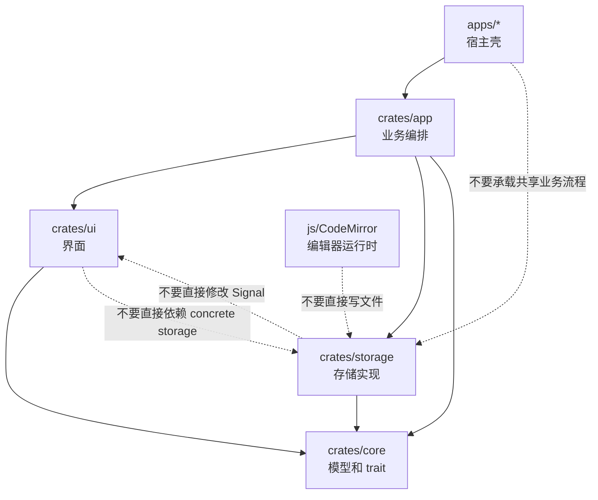

可以运行依赖检查脚本：

```bash
node scripts/check-workspace-deps.js
```

## 12. 性能设计思路

当前项目很重视编辑体验，所以架构上有一些性能取舍。

### 12.1 不把所有状态塞进一个大对象

文件树、tab、正文内容、UI 设置分开存。

这样 sidebar、tabbar、editor、status bar 可以尽量少互相影响。

### 12.2 大 IO 放到 blocking task

打开笔记、保存笔记、扫描 workspace、SQLite 访问，都可能阻塞。

所以 handler 里经常使用：

```rust
tokio::task::spawn_blocking(move || {
    // 文件系统或 SQLite 操作
})
```

这样可以减少 UI 线程卡顿。

### 12.3 派生数据用缓存

Markdown preview、outline、stats 都不应该在每次普通 UI 渲染时重新做重计算。

项目里已有：

- `TabContentsMap` 的 stats 缓存。
- `DocumentDerivedCache`。
- revision 机制。

### 12.4 编辑器 host 尽量复用

CodeMirror 创建成本较高。

JS 侧有 spare pool，Rust 侧也维护每个 tab 的 host 生命周期。

目标是：

- 切换 tab 不要频繁销毁重建 CodeMirror。
- 关闭 tab 的重清理可以延迟。
- 旧 host 的 destroy 不能误伤新 host。

### 12.5 性能 trace

设置环境变量 `PAPYRO_PERF` 后，项目会输出一些性能日志。

常见 trace：

```text
perf editor open note
perf editor input change
perf editor pane render prep
perf editor switch tab
perf runtime close_tab handler
perf chrome open modal
```

这些 trace 是定位卡顿的重要线索。

## 13. 如果你要改功能，应该从哪里下手

先用这张图判断改动落点：

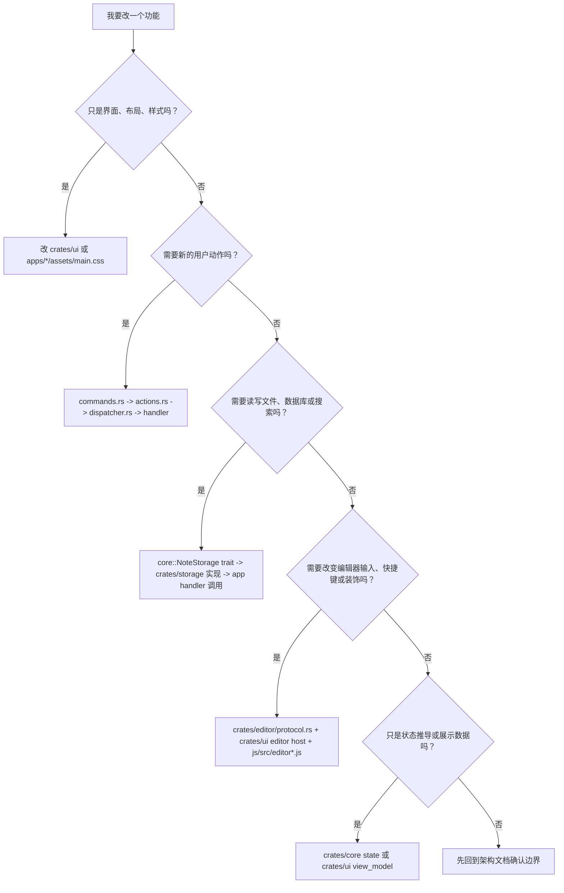

### 13.1 改 UI 样式或布局

优先看：

- [crates/ui/src/layouts](../crates/ui/src/layouts)
- [crates/ui/src/components](../crates/ui/src/components)
- [apps/desktop/assets/main.css](../apps/desktop/assets/main.css)
- [apps/mobile/assets/main.css](../apps/mobile/assets/main.css)

如果只是视觉表现，通常不需要动 `crates/app`。

### 13.2 增加一个按钮

一般路径：

```text
UI 组件中加按钮
-> 调用已有 AppCommands
```

如果已有命令，比如保存、刷新、打开设置，直接调用即可。

如果没有命令，再继续往下加 action。

### 13.3 增加一个新的应用动作

通常需要改：

1. [crates/ui/src/commands.rs](../crates/ui/src/commands.rs)
2. [crates/app/src/actions.rs](../crates/app/src/actions.rs)
3. [crates/app/src/dispatcher.rs](../crates/app/src/dispatcher.rs)
4. 对应 [crates/app/src/handlers](../crates/app/src/handlers)
5. 必要时增加 [crates/app/src/workspace_flow](../crates/app/src/workspace_flow) 用例

原则：

- UI 只发命令。
- dispatcher 做路由。
- handler 管 Signal。
- workspace_flow 管具体业务步骤。

### 13.4 增加一种存储能力

通常需要改：

1. [crates/core/src/storage.rs](../crates/core/src/storage.rs) 增加 trait 方法。
2. [crates/storage/src/lib.rs](../crates/storage/src/lib.rs) 实现方法。
3. 如果涉及数据库，改 [crates/storage/src/db](../crates/storage/src/db)。
4. 如果涉及文件，改 [crates/storage/src/fs](../crates/storage/src/fs)。
5. app handler 调用这个能力。

不要让 UI 直接调用 storage。

### 13.5 增加编辑器命令

通常需要改：

1. [crates/editor/src/protocol.rs](../crates/editor/src/protocol.rs) 定义 Rust/JS 协议。
2. [crates/ui/src/components/editor/host.rs](../crates/ui/src/components/editor/host.rs) 在合适时机发送命令。
3. [js/src/editor-core.js](../js/src/editor-core.js) 或 [js/src/editor.js](../js/src/editor.js) 实现 JS 行为。
4. [docs/editor-protocol.md](editor-protocol.md) 更新协议文档。
5. 补 JS 测试或 Rust 测试。

关键原则：

- Rust 负责业务真相。
- JS 负责浏览器编辑能力。
- 协议要稳定，不要在 UI 内部散落私有 JSON。

### 13.6 增加设置项

通常需要改：

1. [crates/core/src/models.rs](../crates/core/src/models.rs) 的 `AppSettings`。
2. `WorkspaceSettingsOverrides`，如果该设置支持 workspace 覆盖。
3. [crates/core/src/ui_state.rs](../crates/core/src/ui_state.rs) 的合并逻辑。
4. [crates/ui/src/view_model.rs](../crates/ui/src/view_model.rs)，如果 UI 需要显示。
5. [crates/ui/src/components/settings](../crates/ui/src/components/settings)。
6. storage 设置保存和加载通常已通过 JSON 处理，但要考虑默认值兼容。

## 14. 常见误区

### 误区 1：UI 组件里直接写业务流程

不推荐。

UI 组件应该发命令，而不是自己调用 storage、修改文件、操作数据库。

正确方向：

```text
UI -> commands -> dispatcher -> handler -> flow/storage
```

### 误区 2：`apps/desktop` 里加共享逻辑

不推荐。

`apps/desktop` 是宿主壳，移动端复用不了这里的逻辑。

共享逻辑应该放进 `crates/app`，再由 desktop/mobile 分别挂载。

### 误区 3：`core` 里调用 Dioxus

不推荐。

`core` 应该尽量是纯模型和纯规则。

它可以定义状态结构，但不应该知道 Dioxus runtime 怎么注入 context。

### 误区 4：JS 编辑器直接保存文件

不允许。

JS 编辑器只负责编辑体验。保存文件必须走 Rust 应用层和 storage。

### 误区 5：修改生成出来的 `apps/*/assets/editor.js`

不推荐。

应该改 `js/src/editor.js` 或 `js/src/editor-core.js`，然后运行 JS build。

## 15. 新人阅读顺序

如果你想读代码，建议按这个顺序：

1. [README.md](../README.md)
2. [docs/architecture.md](architecture.md)
3. 本文档
4. [apps/desktop/src/main.rs](../apps/desktop/src/main.rs)
5. [crates/app/src/desktop.rs](../crates/app/src/desktop.rs)
6. [crates/app/src/runtime.rs](../crates/app/src/runtime.rs)
7. [crates/app/src/state.rs](../crates/app/src/state.rs)
8. [crates/app/src/dispatcher.rs](../crates/app/src/dispatcher.rs)
9. [crates/core/src/models.rs](../crates/core/src/models.rs)
10. [crates/core/src/storage.rs](../crates/core/src/storage.rs)
11. [crates/ui/src/context.rs](../crates/ui/src/context.rs)
12. [crates/ui/src/layouts/desktop_layout.rs](../crates/ui/src/layouts/desktop_layout.rs)
13. [crates/ui/src/components/editor/pane.rs](../crates/ui/src/components/editor/pane.rs)
14. [crates/storage/src/lib.rs](../crates/storage/src/lib.rs)
15. [docs/editor-protocol.md](editor-protocol.md)

不要一上来就从 `js/src/editor.js` 或 `crates/storage/src/lib.rs` 通读到底。这两个文件信息量很大，适合有全局概念后再看。

## 16. 开发前检查清单

改代码前先问自己：

- 这是 UI 表现、应用流程、核心模型、存储、平台能力，还是编辑器协议？
- 我改的位置是不是属于对应层？
- UI 有没有直接绕过 command？
- storage 有没有直接碰 Dioxus signal？
- JS 有没有变成业务真相来源？
- 修改会不会让 sidebar 变化触发 editor 重建？
- 修改会不会让输入路径变慢？
- 是否需要补 Rust 测试、JS 测试或文档？

## 17. 一句话总结

Papyro 当前架构的核心思想是：

```text
apps 只做平台启动
app 负责编排业务
core 定义模型和规则
ui 负责界面
storage 负责本地数据
platform 负责系统能力
editor 负责 Markdown 和协议
js 负责 CodeMirror 运行时
```

只要你沿着这个方向找代码，大多数问题都会有明确落点。
