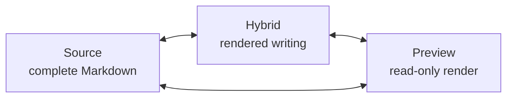
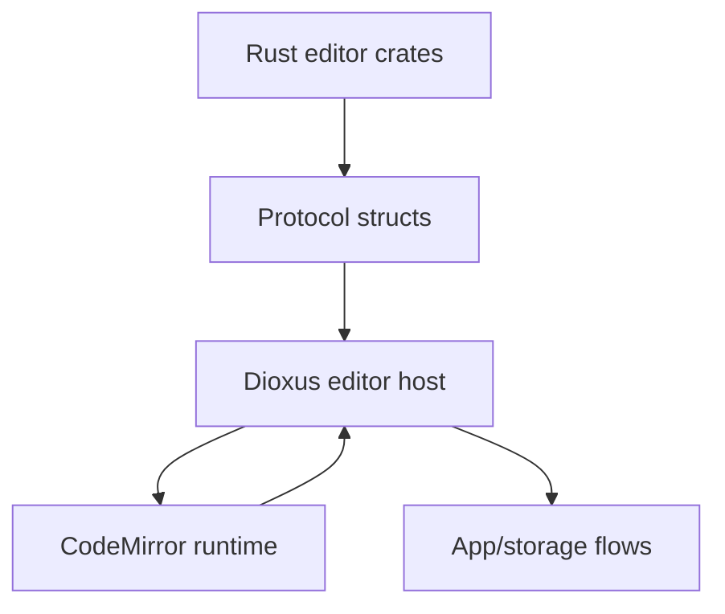

# Markdown Editor Guide

[简体中文](zh-CN/editor.md) | [Documentation](README.md)

Papyro's editor is the product center. Source mode must stay trustworthy, Preview mode must stay readable, and Hybrid mode must become comfortable enough for daily writing.

## Goals

- Keep Markdown files portable and human-readable.
- Make common writing tasks feel modern: headings, lists, links, tables, code, math, images, and Mermaid should be easy to insert and edit.
- Keep Source mode available for exact control.
- Keep Preview and Hybrid visually aligned.
- Preserve selection, cursor, undo, paste, and IME behavior before adding more decoration.

## Modes

| Mode | Purpose | Editing |
| --- | --- | --- |
| Source | Plain Markdown editing | Full source text |
| Hybrid | Rendered Markdown blocks with editable behavior | Main writing mode |
| Preview | Rendered document | Read-only |

## Rust And JS Responsibilities

Rust owns:

- Markdown summary and document stats
- outline extraction
- block analysis for Hybrid hints
- HTML rendering for Preview
- code highlighting through `syntect`
- protocol structs in `crates/editor/src/protocol.rs`

JS owns:

- CodeMirror state and extensions
- input commands and paste behavior
- selection, cursor, scroll, and IME handling
- Hybrid decorations and widget behavior
- Mermaid, KaTeX, CodeMirror language support

The app layer owns:

- tab truth
- content truth
- dirty/save/conflict state
- storage writes
- workspace context

## Hybrid Product Bar

Hybrid is not complete when it merely hides Markdown markers. It should compare well with modern Markdown and document tools such as Typora and Feishu Docs.

For the architecture review behind the next Hybrid stabilization pass, see [Hybrid Editor Architecture Review](editor-hybrid-architecture.md).

Expected capabilities:

- headings render after confirmation and remain directly editable
- lists continue, indent, outdent, and select predictably
- checkboxes can be toggled without damaging Markdown source
- links and inline code do not unexpectedly reveal source on normal clicks
- code blocks preserve cursor hit testing and selection contrast
- Mermaid blocks can be edited while keeping rendered feedback visible
- tables can be inserted, navigated, and edited without manual pipe alignment
- inline and display math can be inserted and corrected with clear feedback
- paste replaces selected text and preserves expected Markdown behavior
- IME composition is never interrupted by Markdown shortcuts

## Block Editing Priorities

| Block | Required behavior |
| --- | --- |
| Heading | rendered style, stable cursor, marker access only when needed |
| List | continuation, indentation, checkbox toggle, selection stability |
| Table | insert table, add/remove row/column, cell navigation, alignment |
| Code block | syntax highlighting, stable hit testing, visible selection |
| Inline code | consistent selection background, no accidental source reveal |
| Link | clickable affordance plus predictable edit path |
| Math | inline/display insertion, rendered preview, error feedback |
| Mermaid | side-by-side edit/render path for complex diagrams |
| Image | paste/import local asset, render safely, preserve Markdown link |

## Insertion Entry

The command palette includes insertion commands for common blocks: table, fenced code block, display math, Mermaid diagram, and task list. These commands insert Markdown into the active tab through the editor runtime command queue, so they share the same selection replacement path as pasted snippets.

## Markdown Rendering

Current Rust-side stack:

- `pulldown-cmark` for Markdown parsing
- `syntect` for code highlighting
- HTML sanitization and local image URL handling in `crates/editor/src/renderer/html.rs`

Current JS-side stack:

- CodeMirror 6 for editor state and rendering
- Mermaid for diagrams
- KaTeX for math
- `codemirror-lang-mermaid` for Mermaid syntax support

Before adopting additional Markdown styles or parser/render libraries, prefer mature open-source projects with strong community adoption, clear licenses, and stable maintenance. Candidate research areas:

- [GitHub-style Markdown CSS](https://github.com/sindresorhus/github-markdown-css) for a familiar baseline
- [Shiki](https://github.com/shikijs/shiki) or [highlight.js](https://github.com/highlightjs/highlight.js) theme ecosystems for code style references
- [Catppuccin](https://github.com/catppuccin/catppuccin) or similarly mature palettes for optional theme inspiration

Do not copy large third-party styles blindly. Papyro needs a coherent app design system.

## Protocol Rules

- Rust-to-JS commands must be represented in `crates/editor/src/protocol.rs`.
- JS-to-Rust events must keep payloads stable and test-covered.
- View mode, preferences, content changes, save requests, paste image requests, runtime ready, and runtime error events must remain explicit.
- JS must not write files directly.
- Rust remains the source of truth for saved content, tab state, and workspace state.

## Manual Smoke Checklist

Run this after editor changes:

- type English and Chinese text in Source and Hybrid
- use IME composition in headings and lists
- paste plain text over a selected range
- paste a URL over selected text
- insert heading, list, checkbox, code block, inline code, table, math, and Mermaid
- switch Source -> Hybrid -> Preview and back
- click outline items in each mode
- open a large document and confirm large-document policy messages are understandable
- verify selection color is visible inside inline code, code blocks, and Mermaid edit areas

## Common Mistakes

- Hiding Markdown syntax while breaking cursor hit testing.
- Making current block rendering depend on nearby unrelated lines.
- Recomputing every decoration on every keystroke for large documents.
- Styling Preview and Hybrid differently enough that mode switching feels like a different document.
- Using browser-native controls for complex app UI without styling or accessibility review.
