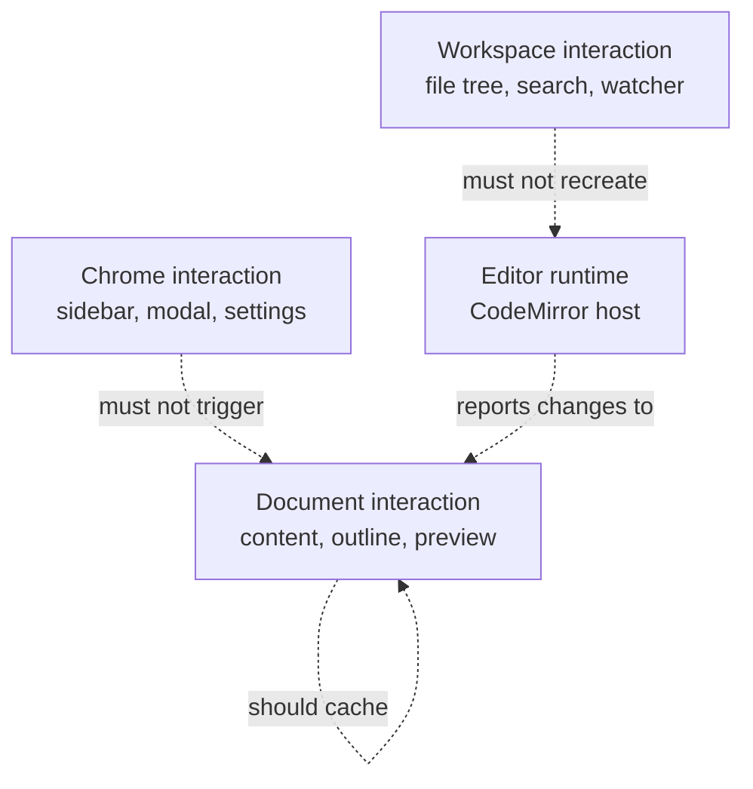

# Performance Budget

[简体中文](zh-CN/performance-budget.md) | [Documentation](README.md)

Papyro is an editor. Performance is part of product quality, not an optimization pass after features are done.

## Budget Principles

- Typing must stay responsive before visual decoration gets richer.
- Tab switching must not rebuild the whole editor shell.
- Chrome actions such as sidebar resize and theme changes must not recompute document HTML.
- Large documents should degrade gracefully: skip expensive live preview or code highlighting before blocking input.
- File operations must move blocking work outside Dioxus render paths.

## Interaction Budgets

| Interaction | Target | Notes |
| --- | --- | --- |
| Normal typing | no visible lag | IME and paste paths count as typing paths. |
| Tab switch | under 100 ms perceived | Existing editor hosts should be reused when possible. |
| View mode switch | under 150 ms perceived | Heavy preview work should use cached document snapshots. |
| Sidebar toggle/resize | under 100 ms perceived | Must not recreate editor runtime. |
| Open small note | under 200 ms perceived | Disk read and metadata update should be bounded. |
| Workspace search | progressive feedback | Large workspaces should show loading state instead of freezing. |
| Preview render | bounded by policy | Large document mode may pause live preview or highlighting. |

These are product budgets. They are intentionally more user-focused than microbenchmark-focused.

## Trace Names

CI checks that these trace names stay documented here and in [roadmap.md](roadmap.md):

- `perf app dispatch action`
- `perf editor pane render prep`
- `perf editor open markdown`
- `perf editor switch tab`
- `perf editor view mode change`
- `perf editor outline extract`
- `perf editor command set_view_mode`
- `perf editor command set_preferences`
- `perf editor input change`
- `perf editor preview render`
- `perf editor host lifecycle`
- `perf editor host destroy`
- `perf editor stale bridge cleanup`
- `perf chrome toggle sidebar`
- `perf chrome resize sidebar`
- `perf chrome toggle theme`
- `perf chrome open modal`
- `perf workspace search`
- `perf tab close trigger`
- `perf runtime close_tab handler`

## Manual Trace Workflow

On Windows PowerShell:

```powershell
$env:PAPYRO_PERF = "1"
cargo run -p papyro-desktop
```

Exercise the interaction, save logs to `target/perf-smoke.log`, then run:

```bash
node scripts/check-perf-smoke.js target/perf-smoke.log
```

Use `node scripts/check-perf-smoke.js --self-test` to validate the checker itself.

## Automated Editor Smoke Coverage

`npm test` in `js/` includes high-risk editor smoke coverage for:

- runtime view-mode commands
- block hint updates
- paste replacement
- Markdown insertion
- editor outline scroll targets
- IME composition guards

Add to that smoke path when changing CodeMirror host lifecycle, Rust-to-JS protocol commands, Hybrid block state, selection handling, paste behavior, or outline navigation.

## Render Path Rules



Rules:

- Do not render large Markdown HTML directly in a Dioxus component body.
- Do not clone large tab contents just to update chrome.
- Do not make preview, outline, and tabbar subscribe to unrelated raw signals.
- Do not rebuild CodeMirror on sidebar, settings, or status bar changes.
- Do not let Hybrid decorations scan unbounded documents on every input.

## Large Document Policy

The editor should degrade in visible, explainable steps:

1. Keep Source editing responsive.
2. Pause live Preview updates if the document is too large.
3. Disable expensive code highlighting before blocking input.
4. Keep outline extraction bounded.
5. Show a status message when a policy disables a feature.

## UI And CSS Budgets

- Keep individual non-generated files under the line budget enforced by `node scripts/report-file-lines.js`.
- Keep repeated visual patterns in reusable classes or components.
- Use semantic tokens instead of one-off colors.
- Run contrast and accessibility checks after UI changes:

```bash
node scripts/check-ui-a11y.js
node scripts/check-ui-contrast.js
```

## When To Update This File

Update this file when:

- a new performance trace is added
- an interaction budget changes
- editor cache policy changes
- a large-document fallback changes
- a render path starts depending on new state
