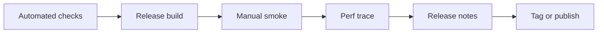

# Release QA Checklist

[简体中文](zh-CN/release-qa.md) | [Documentation](README.md)

Use this checklist before tagging a desktop release or sharing an installer-like build with non-developers. Automated checks must pass first; this file covers the product paths that still need human eyes.

## Release Gate

Do not continue if any earlier step fails.

## 1. Automated Baseline

- [ ] Run `powershell -NoProfile -ExecutionPolicy Bypass -File scripts/check.ps1` on Windows, or `bash scripts/check.sh` on Unix-like systems.
- [ ] Confirm generated editor bundles are synchronized.
- [ ] Confirm `git status --short` contains only intended release changes.
- [ ] Review the latest CI run on `main`.

## 2. Desktop Build

- [ ] Build the desktop package with `powershell -NoProfile -ExecutionPolicy Bypass -File scripts/package-desktop.ps1`.
- [ ] Launch the release binary from the generated `target/dist/papyro-desktop-<os>-<arch>-v<version>/` folder.
- [ ] Confirm `papyro-release-manifest.json` records the expected version and commit.
- [ ] Confirm the window title, icon, favicon, and sidebar logo use the current Papyro assets.
- [ ] Confirm the native `Window`, `Edit`, and `Help` menu bar is not visible.

## 3. First Launch And Workspace

- [ ] Start without `PAPYRO_WORKSPACE` and confirm the app opens a usable default workspace.
- [ ] Open a small workspace and a large project workspace.
- [ ] Confirm workspace scanning does not freeze the shell.
- [ ] Confirm the file tree ignores generated/build directories where expected.
- [ ] Confirm root blank-area context menu can create a root note or folder.

## 4. File Operations

- [ ] Create a note from the sidebar and confirm it opens quickly.
- [ ] Create a folder from a directory context menu.
- [ ] Rename a note and confirm the tab title and file tree update.
- [ ] Delete a note and confirm it moves to trash.
- [ ] Restore a trashed note and confirm the file tree selects it.
- [ ] Reveal a note in the system file explorer.

## 5. Editor Modes

- [ ] Open a Markdown file with headings, lists, tables, links, images, code blocks, math, and Mermaid.
- [ ] Switch between Source, Hybrid, and Preview without losing scroll context.
- [ ] Confirm Preview renders code highlighting, tables, math, and Mermaid.
- [ ] Confirm Hybrid keeps headings, lists, inline code, links, tables, code blocks, math, and Mermaid visually aligned with Preview.
- [ ] Confirm paste replaces selected text.
- [ ] Confirm undo/redo, IME composition, and keyboard navigation behave predictably in Source and Hybrid.

## 6. Navigation And Chrome

- [ ] Toggle the sidebar at normal and narrow window widths.
- [ ] Resize the sidebar and confirm the editor action area remains visible.
- [ ] Toggle outline and click several headings.
- [ ] Confirm outline highlight follows editor or preview scroll position.
- [ ] Open quick open, command palette, search, trash, and recovery modals.
- [ ] Confirm status bar content does not overflow at narrow widths.

## 7. Settings

- [ ] Open Settings from sidebar, editor chrome, and command palette.
- [ ] Switch between General and About without window size changes.
- [ ] Change language and confirm UI text updates after saving.
- [ ] Change theme and confirm the whole shell updates after saving.
- [ ] Change font family, size, line height, auto-link paste, and auto-save delay.
- [ ] Confirm dark-mode contrast is readable in settings navigation and buttons.

## 8. External File Open

- [ ] Configure the release binary as a Markdown opener on the test machine.
- [ ] Open a `.md` file from the operating system.
- [ ] Confirm Papyro adds a tab for that file.
- [ ] Confirm the sidebar switches to the file parent workspace.
- [ ] Open files from two different folders and confirm tab switching updates the sidebar workspace.
- [ ] Confirm dirty tabs are protected before workspace context changes.

## 9. Data Safety

- [ ] Edit a note, close the tab, and confirm dirty confirmation appears.
- [ ] Save a note, edit it externally, then confirm conflict messaging is actionable.
- [ ] Simulate a failed save by making the target read-only and confirm the tab stays dirty.
- [ ] Restart after unsaved edits and confirm recovery drafts are understandable.
- [ ] Empty trash only after confirming the destructive action twice.

## 10. Performance Trace

- [ ] Run `PAPYRO_PERF=1 cargo run -p papyro-desktop`.
- [ ] Capture startup, tab switch, view-mode switch, sidebar toggle, settings open, search, and close-tab interactions.
- [ ] Save logs to `target/perf-smoke.log`.
- [ ] Run `node scripts/check-perf-smoke.js target/perf-smoke.log`.
- [ ] Attach the trace summary to the release notes or release issue.

## 11. Release Notes Evidence

Record the following before publishing:

- Commit SHA.
- Operating system and architecture.
- Build command.
- Check script result.
- Manual QA date and tester.
- Known limitations that still apply.
- Screenshots or short demo media, if the release announcement includes them.
