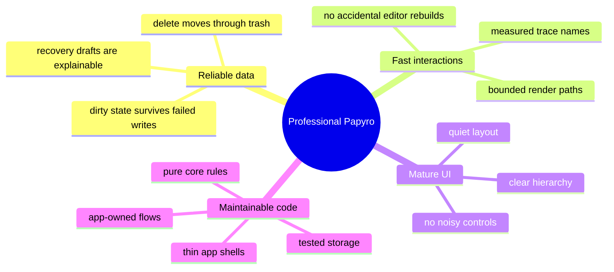
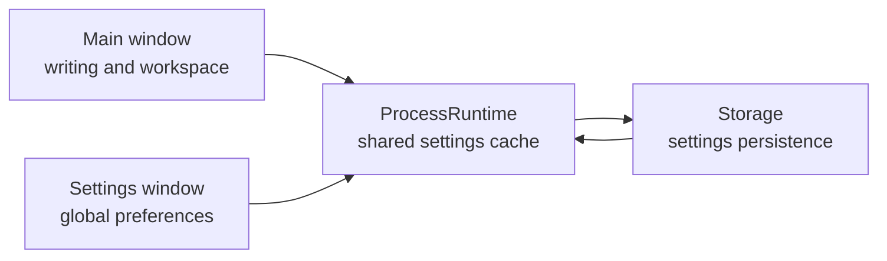
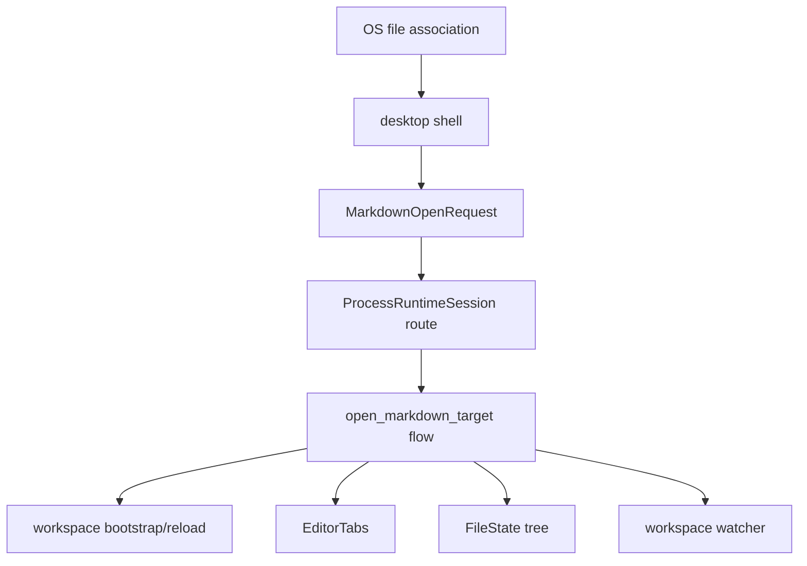

# Papyro Roadmap

[简体中文](zh-CN/roadmap.md) | [Documentation](README.md)

Papyro's roadmap is intentionally focused. The product should become a professional local-first Markdown workspace before it becomes a large feature platform.

## Product North Star

Papyro should feel like a calm desktop writing tool:

- local Markdown files stay user-owned and portable
- Hybrid mode feels close to Typora for everyday writing
- Source and Preview remain available for advanced control
- workspace, tabs, search, outline, trash, assets, and recovery feel predictable
- startup, tab switching, file operations, and editing stay responsive on real projects
- the architecture remains understandable for new contributors

## Quality Bar

## Current Architecture Facts

- `apps/desktop` and `apps/mobile` are thin shells.
- `crates/app` owns runtime, dispatcher, handlers, effects, and workspace flows.
- `crates/core` owns models, state, traits, and pure rules.
- `crates/ui` owns Dioxus components, layouts, view models, and i18n.
- `crates/storage` owns SQLite, filesystem, workspace scanning, watcher, metadata, and recovery.
- `crates/platform` owns system integration.
- `crates/editor` owns Markdown summary, rendering, block analysis, and protocol structs.
- `js/` owns the CodeMirror runtime and generated editor bundle.

See [architecture.md](architecture.md) for the current map.

## Phase 1 - Foundation And Data Safety

Goal: make workspace, tab, settings, save, and recovery flows reliable.

- [x] Move shared runtime orchestration into `crates/app`.
- [x] Keep platform shells thin.
- [x] Split workspace flows into use-case modules.
- [x] Preserve dirty state on failed saves.
- [x] Add recovery draft flows.
- [x] Add settings persistence queue.
- [x] Add workspace dependency checks.
- [ ] Audit save/conflict paths for external file changes and OS-opened Markdown files.
- [x] Make file association open requests a first-class use case with tests.

## Phase 2 - Performance As A Contract

Goal: make common interactions measurable and hard to regress.

- [x] Add trace names for editor and chrome interactions.
- [x] Add performance smoke checker.
- [x] Add file line budget checks.
- [x] Add UI accessibility and contrast checks.
- [x] Keep generated editor bundles synchronized.
- [ ] Capture manual desktop traces before large editor or chrome changes.
- [ ] Add automated smoke coverage for the highest-risk editor paths.

Tracked trace names:

- `perf app dispatch action`
- `perf editor pane render prep`
- `perf editor open markdown`
- `perf editor switch tab`
- `perf editor view mode change`
- `perf editor outline extract`
- `perf editor command set_view_mode`
- `perf editor command set_preferences`
- `perf editor input change`
- `perf editor preview render`
- `perf editor host lifecycle`
- `perf editor host destroy`
- `perf editor stale bridge cleanup`
- `perf chrome toggle sidebar`
- `perf chrome resize sidebar`
- `perf chrome toggle theme`
- `perf chrome open modal`
- `perf workspace search`
- `perf tab close trigger`
- `perf runtime close_tab handler`

## Phase 3 - Desktop Shell And Core UX

Goal: make the app look and behave like a professional note editor.

- [x] Redesign desktop shell layout.
- [x] Improve sidebar icons, menus, root selection, and empty-area context menu behavior.
- [x] Remove the native desktop menu bar.
- [x] Add i18n support for English and Chinese UI text.
- [x] Improve settings layout and dark-mode contrast.
- [x] Replace app shell branding assets.
- [ ] Move Settings into an independent desktop window.
- [ ] Keep settings window size stable across sections.
- [ ] Replace native-looking `select`, modal, message, menu, and tooltip surfaces with Papyro design-system components.
- [ ] Define component primitives for `Button`, `IconButton`, `Select`, `SegmentedControl`, `Modal/Dialog`, `Message/Toast`, `ContextMenu`, `Tooltip`, `Tabs`, and `FormField`.
- [ ] Use proven open-source component systems as references, not direct React dependencies. [Radix Primitives](https://github.com/radix-ui/primitives) is a strong behavior/accessibility reference, and [shadcn/ui](https://github.com/shadcn-ui/ui) is a strong copy-and-own visual/component composition reference.
- [ ] Finish mobile layout pass after desktop behavior stabilizes.

Settings-window direction:

The settings window should be a process-level tool window. It should update live settings without forcing the main editor window to remount.

## Phase 4 - Markdown Editing Experience

Goal: make Hybrid mode useful for real writing, not just decorated source text.

- [x] Add Rust block analysis for headings, lists, tables, code, math, and Mermaid.
- [x] Add Preview rendering with code highlighting and Mermaid support.
- [x] Add Hybrid decorations and runtime block states.
- [x] Improve paste replacement and Markdown input commands.
- [x] Add Mermaid rendered/editing behavior.
- [ ] Make Hybrid selection, cursor hit testing, and inline decorations feel consistent.
- [ ] Make code block, inline code, links, lists, and Mermaid editing share consistent selection colors.
- [ ] Treat cursor offset, wrong-line hit testing, missing selection background, accidental source reveal, and selection leaking into whitespace as architecture-level Hybrid defects, not isolated CSS bugs.
- [ ] Review mainstream editor architecture patterns before continuing Hybrid patches: CodeMirror decorations/widgets, ProseMirror/Tiptap node views, Lexical decorators, Slate void/inline nodes, and Typora-like source/render switching.
- [ ] Decide a stable selection and hit-testing strategy for inline elements, code blocks, tables, math, Mermaid, and links before adding more Markdown block features.
- [ ] Add regression coverage or repeatable smoke scripts for cursor placement, text selection, IME composition, paste replacement, and block edit/render transitions.
- [ ] Align Hybrid editing with modern Markdown writing tools such as Typora and Feishu Docs: inserting tables, math, code blocks, callouts, links, images, and Mermaid should be discoverable and fast.
- [ ] Add editor insertion affordances for common blocks instead of requiring users to remember Markdown syntax for every task.
- [ ] Make table creation and editing feel document-native: add rows/columns, move between cells, preserve alignment, and avoid layout jumps.
- [ ] Make math insertion and editing first-class, including inline math, display math, preview feedback, and error states.
- [ ] Treat enterprise-grade editing as the bar: predictable paste, undo, selection, IME, keyboard navigation, accessibility, and stable layout are required before calling Hybrid complete.
- [ ] Decide whether long-term Hybrid remains CodeMirror decoration-based or moves toward a richer document model.

See [editor.md](editor.md).

## Phase 4.5 - Themes, Typography, And Markdown Styles

Goal: give users several high-quality visual choices without making the app feel like a random theme gallery.

- [ ] Define a theme system with semantic tokens for app chrome, editor canvas, Markdown content, code blocks, selections, focus rings, and status colors.
- [ ] Ship a small curated set of polished themes first: System, Light, Dark, GitHub-like light/dark, high-contrast, and one warm reading theme.
- [ ] Research open-source Markdown style references before adopting any visual baseline. Candidate references include [`sindresorhus/github-markdown-css`](https://github.com/sindresorhus/github-markdown-css) for GitHub-flavored Markdown layout and color behavior, plus well-known code theme ecosystems such as [Shiki](https://github.com/shikijs/shiki), [highlight.js](https://github.com/highlightjs/highlight.js), and [Catppuccin](https://github.com/catppuccin/catppuccin).
- [ ] Keep Markdown render styles compatible across Preview and Hybrid so headings, lists, tables, blockquotes, code, math, and Mermaid do not visually drift between modes.
- [ ] Replace odd font presets with practical system-first presets: UI Sans, System Serif, Reading Serif, Mono Code, and CJK-friendly fallback stacks.
- [ ] Make font settings understandable for normal users: preview text, clear labels, safe defaults, and no obscure font names as the first choices.
- [ ] Add theme and Markdown-style snapshot/smoke checks so future CSS changes do not break contrast, spacing, or code readability.

## Phase 5 - File Association, Tabs, And Workspace Sessions

Goal: make external Markdown files feel native.

Required behavior:

- [ ] When the OS opens a Markdown file with Papyro, the current window receives the file-open event.
- [ ] Tabs update to include the opened Markdown file.
- [ ] The sidebar workspace switches to the opened file's parent workspace when needed.
- [ ] If several tabs belong to different workspace roots, switching tabs updates the sidebar tree to that tab's workspace.
- [ ] Dirty tabs are flushed or protected before switching workspace context.
- [ ] Watcher subscriptions follow the active workspace safely.
- [ ] Recent workspace/file metadata records this flow.

Recommended architecture:

Professional constraints:

- Opening a file outside the current workspace must not silently discard dirty tabs.
- The active tab should be the source of truth for which workspace tree is shown.
- A future multi-window mode must route files through a real `WindowSession`, not a one-off desktop shortcut.
- Tests should cover same-workspace open, external-parent bootstrap, dirty-tab protection, watcher switching, and tab activation.

## Phase 6 - Multi-Window Mode

Goal: support advanced workflows after single-window routing is reliable.

- [ ] Define production `ProcessRuntime` and `WindowSession` ownership.
- [ ] Move settings to a process-level tool window first.
- [ ] Add document window routing behind `NoteOpenMode::MultiWindow`.
- [ ] Ensure each window owns its own tab contents, selection, and dirty state.
- [ ] Share storage and settings safely across windows.
- [ ] Add save-conflict tests across windows.

Multi-window should not be rushed. It is a reliability feature, not just a UI feature.

## Phase 7 - Packaging And Release Readiness

Goal: make Papyro installable and understandable for non-developers.

- [ ] Define license.
- [ ] Add release packaging for desktop.
- [ ] Add app icons for target platforms.
- [ ] Add first-run workspace onboarding.
- [ ] Add manual QA checklist for release builds.
- [ ] Add screenshots or short demo media to README.
- [ ] Document known limitations.

## Ongoing Product Principles

- Avoid adding permanent chrome unless it improves writing or navigation.
- Prefer icons for familiar actions and text for destructive or ambiguous actions.
- Keep the editor area visually calm.
- Do not hide data safety behind convenience.
- Treat performance budgets as feature requirements.
- Keep architecture docs current enough that a new contributor can make the next correct change.
