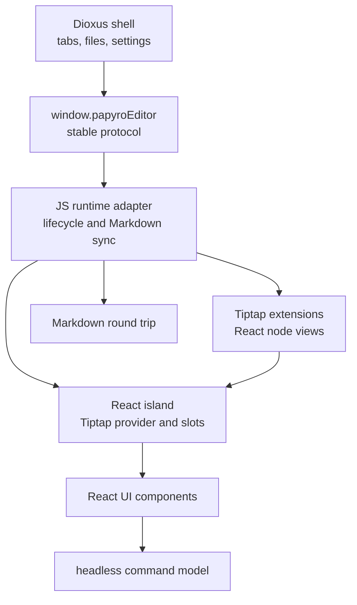

# Tiptap Official React Strategy

[简体中文](zh-CN/tiptap-official-react-strategy.md) | [Tiptap React runtime plan](tiptap-react-runtime-plan.md) | [Enterprise editor TODO](tiptap-enterprise-editor-todo.md) | [Roadmap](roadmap.md)

This document records the official-first strategy for the `feat-tiptap` editor work. It exists because Papyro should stop growing one-off DOM overlays and move toward the same React/Tiptap composition model used by the official Tiptap examples.

## Decision

Papyro keeps the Rust/Dioxus shell, local Markdown storage, and `window.papyroEditor` facade. The rich editor surface moves behind a React island that uses official Tiptap 3 React APIs and legally reusable Tiptap UI code.

The target shape is:



React is not a second app shell. It is the editor UI runtime. Dioxus remains the product shell.

## Official Sources Checked

Before this decision, the local official sources were refreshed and reviewed:

- `E:\tiptap\packages\react\src\Tiptap.tsx`
- `E:\tiptap\packages\extension-drag-handle-react`
- `E:\tiptap\packages\extension-node-range`
- `E:\tiptap\packages\extension-table`
- `.reference/tiptap-docs/src/content/guides/react-composable-api.mdx`
- `.reference/tiptap-docs/src/content/editor/getting-started/install/react.mdx`
- `.reference/tiptap-docs/src/content/ui-components/templates/notion-like-editor.mdx`
- `.reference/tiptap-docs/src/content/ui-components/node-components/table-node.mdx`
- `.reference/tiptap-ui-components/README.md`

The current installed Tiptap packages in `js/package.json` are pinned to the same `3.23.1` version, which matches Tiptap's package-version consistency rule and the current Tiptap UI CLI component output.

## License Boundary

Use this table before copying or adapting any Tiptap UI code:

| Source | Status | Papyro action |
| --- | --- | --- |
| `@tiptap/*` core packages | Open-source package dependencies | Use directly when all package versions stay aligned. |
| Public `ueberdosis/tiptap-ui-components` repository | MIT-licensed components and simple editor template | Copy-own-adapt into Papyro React components when useful, preserving license attribution if source is copied. |
| Official Notion-like editor template | Requires Tiptap Start plan for production | Use as UX benchmark only unless licensed source is generated for this project. |
| `table-node`, `drag-context-menu`, `slash-dropdown-menu` docs components | Marked non-free / non-open in official docs | Use only through accepted Pro/Start terms and generated CLI output. Re-create behavior locally when no license is active. |
| Tiptap Cloud collaboration, AI, comments, conversion | Cloud or paid features depending on capability | Keep out of the local-first editor unless the product explicitly adopts those services. |

Licensed Tiptap CLI output is now used for the table-node chrome path. The generated source lives in the CLI-managed component tree under `js/src/components/`, while local compatibility shims stay small and explicit. The registry token files (`.npmrc` and `js/.npmrc`) are local-only credentials and must never be committed.

Run Tiptap UI CLI commands from the JS package, not from the repository root:

```powershell
npx @tiptap/cli@latest info --cwd js
npx @tiptap/cli@latest add --cwd js table-node
```

Running the component installer from `E:\papyro` reports "Directory not found" because the initialized UI component project is `E:\papyro\js`.

For new official UI surfaces, do not run a broad component install straight into the live component tree. The CLI can prompt to overwrite existing Papyro primitives and may add AI, collaboration, mention, or emoji helpers that are not part of the local-first runtime. Generate one surface at a time, review the diff, and merge only the files that match the product scope.

## Licensed Table Node Integration

The current table migration uses licensed official `table-node` output instead of continuing ad hoc table chrome patches:

- Official component source is installed under `js/src/components/tiptap-node`, `js/src/components/tiptap-ui`, `js/src/components/tiptap-ui-primitive`, `js/src/components/tiptap-icons`, `js/src/hooks`, `js/src/lib`, and `js/src/styles`.
- `js/src/tiptap-react/official-table-node-layer.jsx` mounts the official table handle, selection overlay, cell menu, and row/column extension buttons through the existing React island overlay slot.
- `js/src/components/tiptap-node/table-node/extensions/table-node-extension.js` re-exports Papyro's `TableKit` boundary so Markdown persistence, table attributes, and local table commands stay owned by Papyro.
- `js/src/tiptap-table.js` registers the official `tableHandleExtension` alongside the Papyro table extensions.
- `js/src/editor-tiptap-entry.js` disables the legacy non-menu table chrome renderer so old DOM handles and the official table-node overlay do not compete for hover and selection state.
- `js/build.js` inlines imported SCSS into `editor.js`, which keeps desktop and mobile runtime styling self-contained instead of depending on an unreferenced `assets/editor.css`.

## Architecture Rules

- `js/src/tiptap-runtime.js` owns editor lifecycle, Rust message routing, Markdown sync, and controller attachment.
- `js/src/tiptap-react/` owns React composition: provider, slots, shared hooks, editor UI components, and future React node views.
- `js/src/tiptap-react-island.jsx` is only a compatibility shim. New imports should use `js/src/tiptap-react/index.js`.
- Existing DOM controllers under `js/src/tiptap-*.js` are migration candidates, not the final pattern for advanced chrome.
- Commands must be headless data plus execution callbacks, so slash menus, block handles, toolbar buttons, keyboard paths, and tests share one source of truth.
- React components should use Papyro design tokens and small focused modules. Avoid one giant `NotionEditor.jsx`.

## Migration Path

1. Keep the React island mount lifecycle stable and tested.
2. Move insertion and block action panels into React components backed by the existing headless command definitions.
3. Replace block handle behavior with official `@tiptap/extension-drag-handle-react` and `@tiptap/extension-node-range` where the Markdown-first model allows it.
4. Rebuild floating formatting as React menus using Tiptap state selectors instead of DOM polling.
5. Rework table chrome around `@tiptap/extension-table` and React overlays. If the official `table-node` component is licensed, prefer integrating that source over rebuilding the same advanced handles by hand.
6. Convert code block, image, callout, math, Mermaid, and table surfaces into React node views only when they improve maintainability or user experience.
7. Delete obsolete DOM controllers and CSS after each surface is migrated and covered by tests.

## Drag Handle Integration Decision

The free official path is viable for the next block-handle migration:

- Use `@tiptap/extension-drag-handle-react` for hover tracking, plugin lifecycle, drag start/end, and ProseMirror-safe node positioning.
- Enable nested drag targeting with official defaults. The official default rules already avoid dragging table rows/cells/headers, avoid inline/text nodes, and target list items instead of their first child paragraph.
  - Foundation added: `js/src/tiptap-official-drag-handle.js` centralizes the official DragHandle plugin key, nested targeting options, and Papyro rules that keep complex blocks as outer owners while leaving table internals to table overlay controls.
- Keep Papyro's React block handle as the rendered children so the UI still has two separate controls: drag/action handle and insert `+`.
- Use Papyro's action menu for click/right-click actions. The official drag handle owns drag behavior; Papyro owns contextual actions, copy/delete/turn-into/color, and the insert menu.
  - Foundation added: when Papyro opens the block action or insert menu, the compatibility controller locks the official DragHandle plugin and releases it when the menus close. This mirrors the official menu-stability pattern while the final React behavior migration continues.
- Use `@tiptap/extension-node-range` for block-range selection and keyboard range behavior where it does not fight Markdown persistence.
  - Foundation added: Papyro now includes the official `NodeRange` extension with its conservative default `Mod` pointer key and Papyro-themed `.ProseMirror-selectednoderange` styling.
- Do not let the generic block handle own table cell/row/column controls. Table cells, ranges, row handles, column handles, and resize affordances remain table overlay responsibilities.
- Keep the current compatibility controller until the official plugin path covers click actions, menu stability, block highlight, drag reorder, and complex-node ownership with tests.

This split keeps the official package responsible for ProseMirror node tracking and dragging, while Papyro keeps product-specific actions, i18n, local Markdown behavior, and table UX.

## Quality Bar

A Papyro Tiptap feature is not complete until:

- Source, Hybrid, and Preview still round-trip Markdown safely.
- Chinese and English labels are provided.
- Pointer, keyboard, focus, and outside-dismiss behavior are tested.
- WebView focus races are handled deliberately.
- Generated `assets/editor.js` copies are rebuilt and committed.
- The implementation uses official APIs or documented local abstractions rather than direct DOM guesswork.
