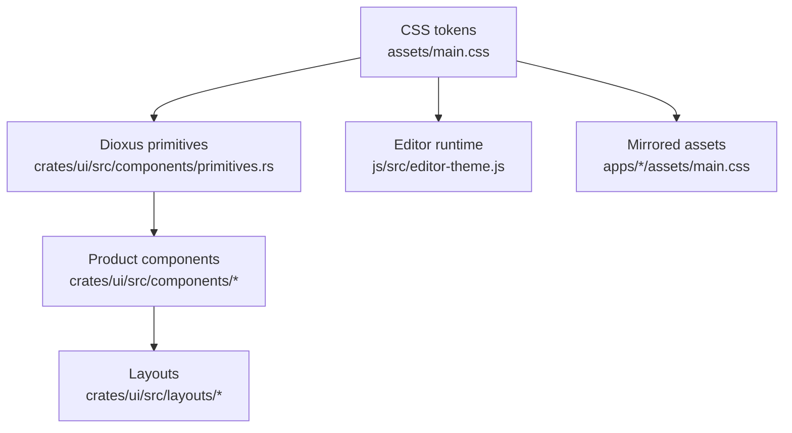

# UI Architecture And Component Inventory

[简体中文](zh-CN/ui-architecture.md) | [Documentation](README.md)

This document explains how Papyro UI should be organized during the Phase 3.5 redesign. It complements [UI/UX Benchmark And Redesign Decisions](ui-ux-benchmark.md), [Papyro UI Visual Brief](ui-visual-brief.md), [UI Information Architecture](ui-information-architecture.md), and [Theme System](theme-system.md).

## Ownership Model

Rules:

- `assets/main.css` is the shared visual source.
- `apps/desktop/assets/main.css` and `apps/mobile/assets/main.css` mirror runtime copies and must stay synchronized when CSS changes.
- `crates/ui/src/components/primitives.rs` owns reusable Dioxus controls.
- Product components compose primitives and should avoid inventing control behavior.
- Layout modules arrange product regions; they should not own button, menu, or field styling.
- `js/src/editor-theme.js` consumes the same CSS tokens for CodeMirror and Hybrid rendering.

## Current Component Inventory

| Area | Current Components | Notes |
| --- | --- | --- |
| Primitives | `Button`, `IconButton`, `Select`, `Dropdown`, `SegmentedControl`, `Tabs`, `Modal`, `Menu`, `ContextMenu`, `MenuItem`, `Tooltip`, `Message`, `StatusMessage`, `StatusIndicator`, `FormField`, `Toggle`, `Slider`, `TextInput`, `EmptyState` | Good foundation, but still needs stronger state contracts, variants, keyboard behavior, and docs. |
| App chrome | `Sidebar`, `FileTree`, `AppHeader`, `StatusBar`, `DesktopLayout`, `MobileLayout` | Should migrate shared row behavior into `SidebarItem`, `TreeItem`, and layout primitives. |
| Editor | `EditorPane`, `EditorChrome`, `EditorTabButton`, `OutlinePane`, `PreviewPane`, `EditorHost`, `FallbackEditor` | Needs stable chrome zones, tab overflow rules, outline behavior, and shared Markdown visual tokens. |
| Modal surfaces | `SettingsModal`, `QuickOpenModal`, `CommandPaletteModal`, `SearchModal`, `TrashModal`, `RecoveryDraftsModal`, `RecoveryDraftCompareModal` | Should share dialog shells, result rows, empty states, loading states, and keyboard focus behavior. |
| Settings | `SettingsSurface`, `SettingsNavButton`, `SettingSection`, `TagManagementSection`, `TagEditorRow`, `AboutMetaItem` | First candidate for controlled redesign because it exercises forms, navigation, and state binding. |
| Search/commands | `CommandPaletteRow`, `QuickOpenRow`, `SearchResultRow`, `HighlightedText` | Should converge into a shared `ResultRow` or `CommandRow` pattern. |
| Recovery/trash | `RecoveryDraftRow`, `RecoveryComparePanel`, `TrashNoteRow` | Should reuse future list-row and destructive-action patterns. |

## Target Primitive Set

| Primitive | Status | Required Work |
| --- | --- | --- |
| `Button` | Exists | Add size, loading, leading/trailing icon, and stronger variant naming. |
| `IconButton` | Exists | Add selected/current, disabled, destructive, compact, and tooltip placement support. |
| `Input` / `TextInput` | Partial | Rename into one primitive family with label, error, disabled, and inline action support. |
| `Select` | Exists | Add keyboard navigation, option groups when needed, and size variants. |
| `SegmentedControl` | Exists | Keep for small enumerations such as theme and view mode. Add disabled options if needed. |
| `Switch` | Exists as `Toggle` | Rename or alias to `Switch`; document checked, disabled, focus-visible states. |
| `Dialog` / `Modal` | Exists | Split primitive shell from product modal content; support stable dimensions and focus management. |
| `Popover` | Missing | Needed for insert menu, compact settings hints, and editor affordances. |
| `DropdownMenu` | Partial through `Menu` | Add trigger, alignment, keyboard handling, separators, icons, and shortcuts. |
| `ContextMenu` | Exists | Keep as menu shell; share item model with dropdown menu. |
| `Tooltip` | Exists | Add placement and delay policy if CSS-only tooltip becomes insufficient. |
| `Toast` / `Message` | Partial | Separate inline status from transient toast. |
| `Tabs` | Exists | Distinguish segmented tabs from document tab bar. |
| `SidebarItem` | Missing | Needed to unify sidebar buttons, workspace rows, and navigation rows. |
| `TreeItem` | Missing | Needed to own file/folder icons, expand state, keyboard state, selected state, and context-menu affordance. |
| `Toolbar` | Missing | Needed for editor chrome and fixed action zones. |
| `EmptyState` | Exists | Add compact, onboarding, error, and action variants. |
| `Skeleton` | Missing | Needed for workspace load, search load, and future async windows. |
| `InlineAlert` / `ErrorState` | Missing | Needed for preview errors, settings validation, recovery, and storage failures. |

## Product Patterns

Build these patterns from primitives before redesigning more screens:

| Pattern | Used By | Contract |
| --- | --- | --- |
| `SettingsRow` | Settings, future preferences windows | One-column label, description, control, optional error/helper text. |
| `ResultRow` | Search, quick open, command palette | Icon, primary text, secondary text, metadata, highlight, keyboard-current state. |
| `TreeRow` | File tree | Indent, disclosure, file/folder icon, selected/current, context menu, keyboard target. |
| `ToolbarZone` | Editor chrome, app header | Fixed width or flexible zone with explicit overflow behavior. |
| `DialogSection` | Settings, recovery, trash | Heading, body, optional footer, stable spacing. |
| `InlineStatus` | Save state, preview policy, errors | Tone, icon/text, compact layout, accessible role. |

## CSS Token Rules

Use these token layers:

- Palette tokens: `--mn-bg`, `--mn-surface`, `--mn-ink`, `--mn-accent`.
- Semantic tokens: `--mn-chrome-*`, `--mn-editor-*`, `--mn-markdown-*`, `--mn-code-*`, `--mn-selection-*`, `--mn-status-*`.
- Component tokens: only when a primitive needs a stable contract such as `--mn-button-pad` or `--mn-tabbar-min-height`.

Forbidden in broad UI work:

- raw hex colors inside component CSS, except palette/theme declarations
- one-off spacing that duplicates an existing token
- component styles that only work in light mode
- nested card styling for page sections
- new class names that bypass an existing primitive

Acceptable one-off CSS:

- layout glue for a single product surface
- a temporary migration class listed in this document or the roadmap
- a visual rule that is impossible to express through an existing primitive, followed by a primitive proposal

## Migration Order

1. **Settings rows:** move settings sections to `SettingsRow`, `DialogSection`, `Switch`, `Select`, and `SegmentedControl` contracts.
2. **Result rows:** align command palette, quick open, and search result rows.
3. **Tree rows:** extract file-tree row behavior into a reusable `TreeItem` pattern.
4. **Editor chrome:** split tab overflow, mode switch, outline action, and overflow menu into `ToolbarZone` rules.
5. **Empty/loading/error:** add `Skeleton`, `InlineAlert`, and `ErrorState` before the next broad async UI pass.
6. **Markdown surfaces:** apply shared Markdown tokens only after Hybrid selection and hit testing are stable.

## Review Checklist

Before merging a UI change:

- Does it use existing primitives first?
- Are light, dark, and high-contrast states covered?
- Is keyboard focus visible and reachable?
- Does narrow width keep primary actions reachable?
- Are generated CSS mirrors synchronized?
- Does the change update relevant docs when it changes component rules?
- Is the commit scoped to one surface or one primitive family?
