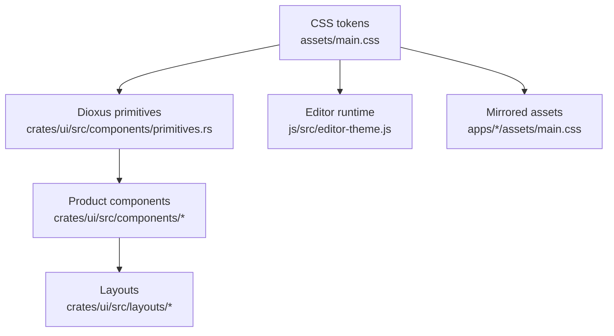

# UI Architecture And Component Inventory

[简体中文](zh-CN/ui-architecture.md) | [Documentation](README.md)

This document explains how Papyro UI should be organized during the Phase 3.5 redesign. It complements [UI/UX Benchmark And Redesign Decisions](ui-ux-benchmark.md), [Papyro UI Visual Brief](ui-visual-brief.md), [UI Information Architecture](ui-information-architecture.md), [UI Surface Audit](ui-surface-audit.md), and [Theme System](theme-system.md).

## Ownership Model

Rules:

- `assets/main.css` is the shared visual source.
- `apps/desktop/assets/main.css` and `apps/mobile/assets/main.css` mirror runtime copies and must stay synchronized when CSS changes.
- `crates/ui/src/components/primitives.rs` owns reusable Dioxus controls.
- Product components compose primitives and should avoid inventing control behavior.
- Layout modules arrange product regions; they should not own button, menu, or field styling.
- `js/src/editor-theme.js` consumes the same CSS tokens for CodeMirror and Hybrid rendering.

## Current Component Inventory

| Area | Current Components | Notes |
| --- | --- | --- |
| Primitives | `Button`, `ActionButton`, `RowActionButton`, `IconButton`, `Select`, `Dropdown`, `SegmentedControl`, `Tabs`, `Modal`, `ModalCloseButton`, `Menu`, `ContextMenu`, `MenuItem`, `Tooltip`, `Message`, `StatusStrip`, `StatusMessage`, `StatusIndicator`, `FormField`, `Switch`, `Toggle`, `Slider`, `TextInput`, `ResultList`, `ResultRow`, `RowActions`, `ModalFooterMeta`, `ComparePanel`, `SkeletonRows`, `ErrorState`, `SettingsLayout`, `SettingsNav`, `SettingsRow`, `SettingsInlineRow`, `SidebarItem`, `DialogSection`, `TreeItemButton`, `TreeItemEditRow`, `EmptyState` | Good foundation, but still needs stronger state contracts, variants, keyboard behavior, and docs. |
| App chrome | `Sidebar`, `FileTree`, `AppHeader`, `StatusBar`, `DesktopLayout`, `MobileLayout` | File-tree rows use `TreeItem` primitives and the workspace root row uses `SidebarItem`; sidebar footer rows still need broader primitive coverage. |
| Editor | `EditorPane`, `EditorChrome`, `EditorTabButton`, `OutlinePane`, `PreviewPane`, `EditorHost`, `FallbackEditor` | Needs stable chrome zones, tab overflow rules, outline behavior, and shared Markdown visual tokens. |
| Modal surfaces | `SettingsModal`, `QuickOpenModal`, `CommandPaletteModal`, `SearchModal`, `TrashModal`, `RecoveryDraftsModal`, `RecoveryDraftCompareModal` | Should share dialog shells, result rows, empty states, loading states, and keyboard focus behavior. |
| Settings | `SettingsSurface`, `TagManagementSection`, `TagEditorRow`, `AboutMetaItem` | Settings now composes shared navigation, panel, row, inline-row, and section primitives; tag management still needs richer validation and helper states. |
| Search/commands | `ResultList`, `ResultRow`, `RowActions`, `CommandPaletteRow`, `QuickOpenRow`, `SearchResultRow`, `HighlightedText` | Command, quick-open, search, trash, and recovery surfaces now share list shells, row shells, and action slots; next work should add icons, shortcuts, richer metadata, and grouped states. |
| Recovery/trash | `RecoveryDraftRow`, `ComparePanel`, `TrashNoteRow` | Recovery and trash list rows use `ResultRow`, recovery comparisons use `ComparePanel`, and trash footer metadata uses `ModalFooterMeta`; conflict/error states still need dedicated data-safety patterns. |

## Target Primitive Set

| Primitive | Status | Required Work |
| --- | --- | --- |
| `Button` / `ActionButton` / `RowActionButton` | Partial | `Button` now covers ordinary dialog, empty-state, editor-empty, settings, recovery, trash, and mobile action buttons; `ActionButton` adds reusable icon and loading/disabled state support; `RowActionButton` keeps result-row actions from triggering row selection. Next work should add size variants and migrate remaining raw button markup with special `title`, `aria`, or keyboard contracts. |
| `IconButton` | Partial | Supports selected, disabled, destructive, custom class, and icon-class states, and now covers app-header and sidebar brand icon buttons. Next work should add compact size variants and tooltip placement. |
| `Input` / `TextInput` | Partial | `TextInput` now covers command/search/quick-open fields plus ordinary sidebar, mobile, and settings tag text fields. Inline tree rename still needs a dedicated path until blur/context-menu contracts move into the primitive family. Next work should add label, error, disabled, and inline action support. |
| `Select` | Exists | Add keyboard navigation, option groups when needed, and size variants. |
| `SegmentedControl` | Exists | Keep for small enumerations such as theme and view mode. Add disabled options if needed. |
| `Switch` | Partial | `Switch` is now the preferred boolean control; `Toggle` remains as a compatibility wrapper. Next work should add disabled and helper/error states. |
| `Dialog` / `Modal` | Partial | `ModalCloseButton` owns repeated modal close controls and `DialogSection` covers repeated settings sections; the modal shell still needs stable dimensions and focus management. |
| `Popover` | Missing | Needed for insert menu, compact settings hints, and editor affordances. |
| `DropdownMenu` | Partial through `Menu` | Add trigger, alignment, keyboard handling, separators, icons, and shortcuts. |
| `ContextMenu` | Exists | Keep as menu shell; share item model with dropdown menu. |
| `Tooltip` | Exists | Add placement and delay policy if CSS-only tooltip becomes insufficient. |
| `Toast` / `Message` / `StatusStrip` | Partial | `StatusStrip` now owns the footer status layout; transient toast still needs a separate primitive. |
| `Tabs` | Exists | Distinguish segmented tabs from document tab bar. |
| `SidebarItem` | Partial | Workspace root rows now use `SidebarItem`; sidebar footer buttons and future navigation rows still need adoption. |
| `TreeItem` | Partial | `TreeItemButton`, `TreeItemEditRow`, and `TreeItemLabel` now own file/folder icons, expand state, selected/editing/drag/drop classes, and row label layout; keyboard model and context-menu scoping remain in file-tree code. |
| `Toolbar` / `ToolbarZone` | Partial | `EditorToolbar` and `ToolbarZone` now wrap the editor chrome's flexible tabs zone and fixed tools zone; split panes, resizable rails, and generic scroll containers still need broader adoption. |
| `EmptyState` | Exists | Add compact, onboarding, error, and action variants. |
| `SkeletonRows` | Partial | Workspace search loading now uses reusable skeleton rows; workspace load and future async windows still need adoption. |
| `InlineAlert` / `ErrorState` | Partial | `InlineAlert` covers preview notices and command/search empty states; `ErrorState` now covers editor runtime failures and should be reused for larger blocking failures. |
| `SettingsLayout` / `SettingsRow` / `SettingsInlineRow` | Partial | Settings navigation, panels, sections, rows, and inline control rows now live in primitives; helper text, errors, and richer form states still need broader use. |

## Product Patterns

Build these patterns from primitives before redesigning more screens:

| Pattern | Used By | Contract |
| --- | --- | --- |
| `SettingsRow` | Settings, future preferences windows | One-column label, optional description, control, and future helper/error slots. |
| `SettingsInlineRow` | Settings tag management, compact form rows | Inline controls with stable create/edit grid contracts and narrow-width migration path. |
| `ResultList` / `ResultRow` | Search, quick open, command palette, trash, recovery | Accessible result list shell plus row icon, primary text, secondary text, metadata, highlight, and keyboard-current state. |
| `RowActions` / `RowActionButton` | Result rows, destructive management rows | Right-aligned row actions with shared spacing, optional wrapping, and scoped click handling. |
| `ModalFooterMeta` | Trash, recovery, destructive dialogs | Leading footer metadata that truncates safely before action buttons. |
| `ComparePanel` | Recovery comparisons, future conflicts | Title, metadata, optional error, scrollable preformatted content, and stable side-by-side sizing. |
| `SkeletonRows` | Search, workspace loading, async windows | Accessible loading rows with stable height, restrained motion, and no layout jump when results arrive. |
| `ErrorState` | Editor runtime, workspace load, blocking failures | Title, user-facing message, optional technical detail, and alert role for non-recoverable inline failures. |
| `TreeRow` | File tree | Indent, disclosure, file/folder icon, selected/editing/drag/drop state, context menu, keyboard target. |
| `ToolbarZone` | Editor chrome, app header | Fixed width or flexible zone with explicit overflow behavior. |
| `DialogSection` | Settings, recovery, trash | Heading, body, optional footer, stable spacing. |
| `InlineStatus` / `StatusStrip` | Save state, preview policy, errors, footer status | Tone, icon/text, compact layout, accessible role. |

## CSS Token Rules

Use these token layers:

- Palette tokens: `--mn-bg`, `--mn-surface`, `--mn-ink`, `--mn-accent`.
- Semantic tokens: `--mn-chrome-*`, `--mn-editor-*`, `--mn-markdown-*`, `--mn-code-*`, `--mn-selection-*`, `--mn-status-*`.
- Component tokens: only when a primitive needs a stable contract such as `--mn-button-pad` or `--mn-tabbar-min-height`.

Forbidden in broad UI work:

- raw hex colors inside component CSS, except palette/theme declarations
- one-off spacing that duplicates an existing token
- component styles that only work in light mode
- nested card styling for page sections
- new class names that bypass an existing primitive

Acceptable one-off CSS:

- layout glue for a single product surface
- a temporary migration class listed in this document or the roadmap
- a visual rule that is impossible to express through an existing primitive, followed by a primitive proposal

## Migration Order

1. **Settings rows:** continue building on `SettingsRow`, `SettingsInlineRow`, `DialogSection`, `SettingsNav`, `Switch`, `Select`, and `SegmentedControl`; next work should add helper/error slots and validation states.
2. **Result rows:** align command palette, quick open, and search result rows.
3. **Tree rows:** continue building on `TreeItemButton` and `TreeItemEditRow`; next work should add focus/current variants and share scoped menu item models.
4. **Editor chrome:** continue building on `EditorToolbar` and `ToolbarZone` for tab overflow, mode switch, outline action, and future overflow menu rules.
5. **Empty/loading/error:** extend `InlineAlert`, `SkeletonRows`, and `ErrorState` across remaining async and blocking surfaces.
6. **Markdown surfaces:** apply shared Markdown tokens only after Hybrid selection and hit testing are stable.

## Review Checklist

Before merging a UI change:

- Does it use existing primitives first?
- Are light, dark, and high-contrast states covered?
- Is keyboard focus visible and reachable?
- Does narrow width keep primary actions reachable?
- Are generated CSS mirrors synchronized?
- Does the change update relevant docs when it changes component rules?
- Is the commit scoped to one surface or one primitive family?
