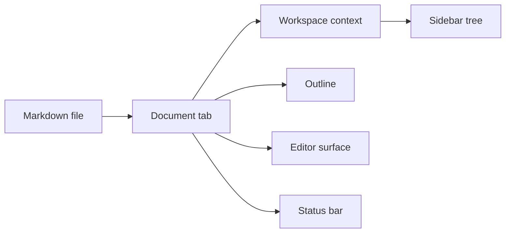
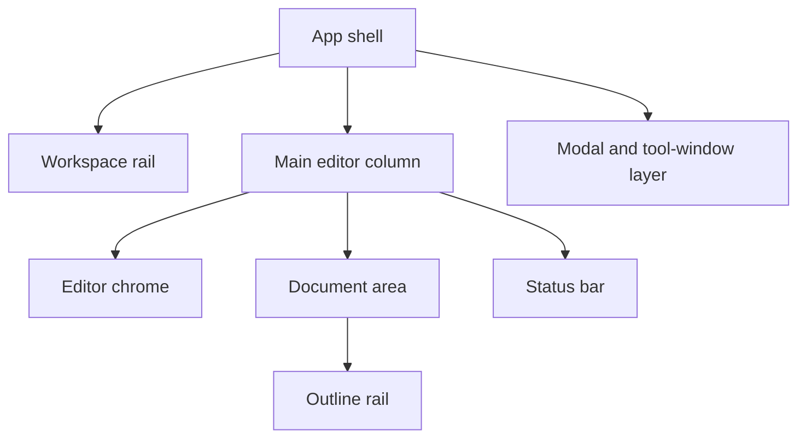
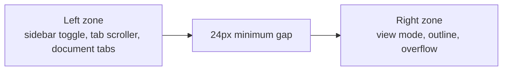
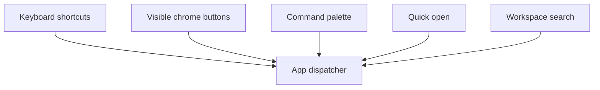
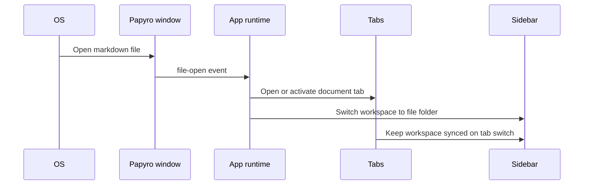

# UI Information Architecture

[简体中文](zh-CN/ui-information-architecture.md) | [Documentation](README.md)

This document defines how Papyro's main product surfaces should relate to each other during the Phase 3.5 UI/UX redesign. It connects the benchmark, visual brief, and component inventory:

- [UI/UX Benchmark And Redesign Decisions](ui-ux-benchmark.md) defines the quality bar.
- [Papyro UI Visual Brief](ui-visual-brief.md) defines tone, spacing, color roles, and motion.
- [UI Architecture And Component Inventory](ui-architecture.md) defines reusable Dioxus primitives and CSS token ownership.

The goal is to stop treating the sidebar, editor, outline, commands, search, settings, and tool windows as separate screens. They should feel like one coherent desktop workspace.

## Product Model

Papyro has four primary information objects:

| Object | Meaning | UI Owner |
| --- | --- | --- |
| Workspace | A folder tree that gives notes local context. | Sidebar and workspace flows |
| Document | One Markdown file, dirty state, view mode, outline, and editor runtime. | Editor pane and tabs |
| Command | A user action launched from UI chrome, shortcuts, or command palette. | Command palette and app dispatcher |
| Preference | Global app configuration such as language, theme, typography, and editor behavior. | Settings window |

The active document owns the active workspace context. When a tab points to a file in another workspace, switching to that tab should make the sidebar follow that workspace. This keeps the app local-first without forcing one global folder for every open note.

## Workspace Shell

Current code: `DesktopLayout` renders `Sidebar`, `EditorPane`, `StatusBar`, and modal surfaces inside `.mn-shell`.

Target architecture:

Rules:

- The sidebar is a workspace navigator. It should not become a miscellaneous command panel.
- The editor column is the writing surface. It owns tabs, view mode, outline visibility, document area, and status.
- The status bar belongs under the main editor column, not under the sidebar.
- Modal surfaces sit above the shell. Settings should eventually become an independent process-level tool window.
- Shell layout rules must be explicit for narrow widths before visual polish begins.

## Sidebar IA

The sidebar answers three questions:

1. Which workspace is active?
2. What files and folders are available?
3. What scoped actions are valid for the selected target?

Target sections:

| Section | Purpose | Notes |
| --- | --- | --- |
| Brand row | App identity, theme shortcut, settings entry. | Keep compact. Do not add secondary slogans. |
| Search entry | Workspace search. | Disabled state must explain that a workspace is required. |
| Workspace root | Current folder path and root selection target. | Clicking blank tree space should return selection to root. |
| File tree | Files, folders, expand state, selected target, context menu. | File, folder, and blank-area menus must have different action sets. |
| Sidebar footer | Low-frequency workspace actions. | Use icon plus text when meaning benefits from reinforcement. |

Context menu rules:

| Target | Allowed Actions | Disallowed Actions |
| --- | --- | --- |
| Workspace root | New note, new folder, reveal/open folder, refresh. | Rename root, delete root. |
| Folder | New note, new folder, rename, delete, reveal/open folder. | Markdown-only actions. |
| Markdown file | Open, rename, delete, reveal/open containing folder. | Create child folder. |
| Blank tree area | Select workspace root, new note at root, new folder at root, refresh. | Rename, delete, file-only actions. |

## Editor Chrome IA

The editor chrome must have two stable zones:

Rules:

- The left zone is flexible and scrollable. It may shrink and scroll, but it cannot push the right zone outside the viewport.
- The right zone is fixed and always reachable. View mode and outline are primary controls.
- Tab overflow is horizontal within the tab bar only.
- Long filenames must truncate inside tab buttons, not resize the whole toolbar.
- Source, Hybrid, and Preview must share the same document identity and outline model.

## Document Area IA

The document area has three modes:

| Mode | User Expectation | IA Rule |
| --- | --- | --- |
| Source | Accurate Markdown source editing. | CodeMirror is the source of interaction truth. |
| Hybrid | Markdown-native writing with rendered affordances. | Selection, cursor hit testing, and block lifecycle are architecture-level concerns. |
| Preview | Read-only rendered document navigation. | Clicks navigate links or outline targets; editing controls stay out of the canvas. |

Hybrid and Preview should not show source-style line numbers by default because rendered block heights differ from source line heights. When diagnostics require line numbers, expose them as a deliberate developer or advanced setting later.

## Outline IA

The outline is document navigation, not a decorative panel.

Rules:

- Width should be stable enough for real headings and slightly wider than the current narrow rail.
- Clicking an item jumps directly to the target heading. Smooth scrolling is optional and should not slow navigation.
- The active heading should update from scroll position in Source, Hybrid, and Preview.
- After an outline click, the clicked heading should become active immediately. Scroll observers may refine it later, but should not briefly highlight the previous heading.
- On narrow windows, outline should collapse into a popover or overlay instead of leaving a hidden, non-responsive button.

## Commands, Search, And Quick Open

These surfaces are power-user routes into the same app model.

Rules:

- Command palette rows, quick open rows, and search rows should share `ResultRow` density, focus, icon, highlight, and metadata patterns.
- Empty, loading, and error states should use shared primitives instead of custom text blocks.
- A command should have one semantic label even if it appears in several places.
- Keyboard focus must be predictable: opening a modal focuses the query or first meaningful control; closing returns focus to the opener when possible.

## Settings IA

Settings are global preferences. Workspace-specific settings were removed from the visible UI because the global/workspace split created unnecessary cognitive load for normal users.

Target sections:

| Section | Purpose |
| --- | --- |
| General | Language, theme, editor typography, paste behavior, autosave delay. |
| About Papyro | Version, license, local-first promise, useful links. |

Rules:

- Settings panel size must remain stable when switching sections.
- Language and theme controls must reflect current global state when opened.
- A control should either apply immediately or wait for a save button. Do not mix the two in the same panel without explicit copy.
- Theme should use a segmented control while the option set is small. Language should use a select because it can grow later.
- In the future independent settings window, localization, theme, icon, and initial shell should load before showing the window to avoid white flashes and Dioxus default branding.

## Multi-Window And File Association IA

Future file association behavior:

Rules:

- Opening a `.md` file from the OS should activate an existing window when possible.
- The target file becomes a tab.
- The file's containing folder becomes the active workspace for that tab.
- If open tabs belong to different folders, switching tabs updates the sidebar context.
- Dirty tabs must be protected before workspace context changes.

## Responsive IA

Narrow windows should degrade deliberately:

| Width Pressure | Expected Behavior |
| --- | --- |
| Sidebar plus editor becomes tight | Sidebar can collapse or shrink within min/max rules. |
| Tab bar overflows | Tabs scroll horizontally inside the left toolbar zone. |
| Editor tools run out of room | Keep view mode and outline reachable; move lower-priority actions into overflow. |
| Outline cannot fit | Use overlay/popover behavior, not an inert hidden panel. |
| Status bar overflows | Wrap or compact within the main column, never outside the viewport. |
| Settings content changes | Window size stays fixed; content scrolls inside. |

## Implementation Sequence

1. Convert this IA into layout primitives: `AppShell`, `WorkspaceRail`, `EditorToolbar`, `ToolbarZone`, `ScrollContainer`, and `ResponsiveOverflow`.
2. Redesign settings on top of stable `Dialog`, `SettingsRow`, `SegmentedControl`, `Select`, and `Button` contracts.
3. Redesign editor chrome with fixed left/right toolbar zones and tab overflow tests.
4. Extract file-tree rows into a reusable `TreeItem` pattern with scoped menus.
5. Align command palette, quick open, and search around one `ResultRow` pattern.
6. Add design QA screenshots for wide, narrow, dark mode, settings section switch, tab overflow, and outline behavior.

## Acceptance Checklist

- Every visible region has a named owner and purpose.
- The same action has the same label, icon, and state wherever it appears.
- Narrow windows keep primary actions reachable.
- Sidebar context follows the active tab.
- Outline works as document navigation in Source, Hybrid, and Preview.
- Settings does not jump in size when switching sections.
- Search, quick open, and command palette share one interaction grammar.
- New one-off CSS is rejected unless the UI architecture document is updated with a migration reason.
