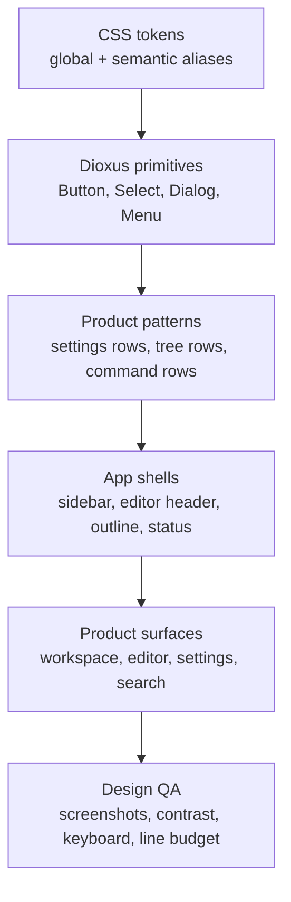

# UI/UX Benchmark And Redesign Decisions

[简体中文](zh-CN/ui-ux-benchmark.md) | [Documentation](README.md)

This benchmark turns the Phase 3.5 roadmap into concrete design decisions. It is not a request to copy another product. Papyro should learn from mature writing tools, then express its own identity: local-first Markdown, calm desktop writing, fast workspace navigation, and predictable data ownership.

Research date: May 2, 2026.

## Reference Set

| Reference | Why It Matters | Public Source |
| --- | --- | --- |
| Feishu/Lark Wiki | Enterprise knowledge base with rich documents, search, permissions, and migration flows. Useful for information architecture and professional density. | [Lark Wiki](https://www.larksuite.com/en_us/product/wiki) |
| Yuque | Chinese knowledge-base product positioned around a strong document editor and structured knowledge spaces. Useful for localizing product expectations. | [Yuque groups](https://www.yuque.com/about/groups) |
| Notion | Block-first writing surface, inline formatting menu, slash commands, templates, databases, and drag-and-drop organization. Useful for insertion and block affordances. | [Writing and editing basics](https://www.notion.com/help/guides/writing-and-editing-basics) |
| Obsidian | Local Markdown model with Reading, Source, and Live Preview modes. Useful for Papyro's Source/Hybrid/Preview contract. | [Views and editing mode](https://obsidian.md/help/edit-and-read) |
| Typora | Markdown-native writing with generated table source, math, diagrams, and low-friction WYSIWYM behavior. Useful for Hybrid editing expectations. | [Markdown Reference](https://support.typora.io/Markdown-Reference/), [Draw diagrams](https://support.typora.io/Draw-Diagrams-With-Markdown/) |
| Fluent 2 | Mature token model, accessibility baseline, and cross-platform semantics. Useful for token naming, theming, and contrast discipline. | [Design tokens](https://fluent2.microsoft.design/design-tokens), [Accessibility](https://fluent2.microsoft.design/accessibility) |
| Radix/shadcn | Good reference for component states and owned component code. Papyro should copy the architecture idea, not the React dependency. | [Radix Primitives](https://www.radix-ui.com/primitives/docs/overview/introduction), [shadcn components](https://ui.shadcn.com/docs/components) |

## Product Direction

Papyro should feel like a quiet professional desktop editor, not a web dashboard and not a marketing page.

Design principles:

- **Local-first confidence:** file location, save state, recovery, trash, and workspace root must always be understandable.
- **Calm density:** the app should carry many tools without looking busy. Prefer compact structure, clear alignment, and restrained color.
- **Writing first:** chrome supports writing but does not compete with the document.
- **Predictable modes:** Source, Hybrid, and Preview must feel intentionally different while sharing typography, selection color, and Markdown rendering rules.
- **Keyboard paths:** command palette, quick open, block insertion, outline navigation, search, and tab switching should be reachable without mouse-only workflows.
- **Component ownership:** Dioxus components own behavior and state; CSS tokens own visual language; random one-off CSS is a last resort.

## Benchmark Matrix

| Surface | Reference Signal | Current Papyro Gap | Redesign Decision |
| --- | --- | --- | --- |
| Workspace navigation | Feishu/Lark and Yuque present knowledge spaces as organized systems, while Obsidian keeps local files explicit. | Sidebar has improved but still lacks a fully designed hierarchy, density model, and root/context explanation. | Treat the sidebar as a durable workspace navigator: root summary, file tree, scoped actions, search entry, and contextual empty states should share one visual system. |
| Editor header | Modern editors keep document actions close but quiet. Notion and Obsidian avoid crowding the writing surface. | Header actions have been repeatedly patched and can still feel assembled. | Split the header into stable zones: document identity, tab overflow, view mode, outline, and overflow actions. Each zone needs fixed responsive rules. |
| Markdown modes | Obsidian separates Reading, Source, and Live Preview; Typora keeps editing close to rendered Markdown. | Hybrid still has cursor, hit-testing, and source-reveal problems. | Hybrid quality is an architecture problem. Do not add more visual polish until selection, pointer semantics, and block lifecycle are reliable. |
| Block insertion | Notion uses slash commands and contextual menus; Typora hides table syntax by generating it. | Papyro has insertion affordances, but they are not yet a cohesive writing flow. | Add a unified insert surface for headings, lists, tables, code, math, Mermaid, images, links, callouts, and horizontal rules. |
| Markdown rendering | Typora and Obsidian value readable headings, lists, code, tables, math, diagrams, and callouts. | Preview and Hybrid styles have improved but still need a stronger editorial system. | Build Markdown style tokens for block spacing, heading rhythm, table density, code backgrounds, callout accents, and selection overlays. |
| Outline | Enterprise docs use outlines as navigation, not decoration. | Outline is clickable now, but responsive behavior and active-section accuracy remain sensitive. | Make outline a navigation component with stable width, active-state rules, keyboard navigation, and small-window fallback. |
| Settings | Fluent-style systems group settings by user task and use stable panels. | Settings has improved but previously suffered from layout shifts and inconsistent control state. | Settings should use a fixed shell, left rail, one-column form rows, segmented controls for small enumerations, and immediate global-state binding. |
| Search and command palette | Mature tools use search and commands as power-user pathways. | Search and commands exist but need one shared interaction grammar. | Share item rows, highlight marks, keyboard focus, empty states, loading states, and result metadata across search, quick open, and commands. |
| Empty/loading/error states | Enterprise UI treats these as product moments, not fallback text. | Some states still read as engineering output. | Add `EmptyState`, `Skeleton`, `InlineAlert`, and `ErrorState` primitives with product copy rules. |
| Theme and color | Fluent uses semantic tokens and supports light, dark, high contrast, and branded variants. | Tokens exist, but old one-off values can still leak into surfaces. | Move toward global tokens plus semantic aliases: canvas, chrome, control, border, text, accent, danger, warning, success, selection, focus. |
| Component states | Radix and shadcn demonstrate explicit parts, variants, focus, disabled, and keyboard states. | Some components have Papyro styling, but the system is not fully documented as an API. | Build and document Dioxus primitives with named variants and required state coverage. |
| Narrow windows | Desktop tools keep primary actions reachable when width shrinks. | Papyro has had repeated overflow regressions. | Define app-shell overflow contracts before visual redesign: tab scroller, action zone, outline collapse, sidebar minimums, and status-bar wrapping. |

## Proposed UI Architecture

The redesign should move in this order:

1. **Design brief:** define tone, typography, spacing, color roles, icons, motion, and density.
2. **Token cleanup:** remove raw color and spacing drift from app chrome and editor surfaces.
3. **Primitive pass:** harden reusable controls before changing every screen.
4. **Surface pass:** redesign one product surface at a time, starting with settings and editor chrome because they expose the most component defects.
5. **Markdown pass:** align Preview and Hybrid once the editor behavior contract is stable.
6. **QA pass:** capture before/after, narrow-width, dark-mode, contrast, and keyboard screenshots/checks.

## Concrete Decisions For Papyro

- Use a **disciplined utility** aesthetic: quiet, precise, slightly editorial, with color used for state and orientation rather than decoration.
- Avoid oversized hero-like chrome inside the app. This is a repeated-use productivity tool.
- Prefer one-column settings forms. Use segmented controls for small enumerations like theme, and selects only when the option set can grow.
- Keep the document canvas white or near-white in light themes, with app chrome subtly separated.
- Make file tree rows and command rows share density, focus ring, icon sizing, and selected-state logic.
- Use icons for frequent actions, but pair destructive or ambiguous actions with text.
- Treat all menus, popovers, and dialogs as first-class components with keyboard and focus behavior.
- Keep Preview and Hybrid Markdown typography synchronized through shared tokens.
- Document every new primitive in the UI architecture guide before using it broadly.

## Immediate Follow-Up Tasks

- [x] Create `docs/ui-visual-brief.md` and `docs/zh-CN/ui-visual-brief.md`.
- [x] Inventory existing Dioxus components and map them to the target primitive list. See [UI Architecture And Component Inventory](ui-architecture.md).
- [x] Add a CSS token audit for raw colors, spacing one-offs, and duplicated component selectors. See [UI Token Audit](ui-token-audit.md).
- [x] Define app information architecture for workspace navigation, editor chrome, outline, commands, settings, responsive behavior, and future multi-window flows. See [UI Information Architecture](ui-information-architecture.md).
- [x] Audit primary UI surfaces and turn redesign risks into a surface-by-surface worklist. See [UI Surface Audit](ui-surface-audit.md).
- [ ] Redesign settings with the new primitive rules as the first controlled surface.
- [ ] Redesign editor chrome and tab overflow rules as the second controlled surface.
- [ ] Add narrow-window and dark-mode screenshots to the manual UI smoke checklist.
