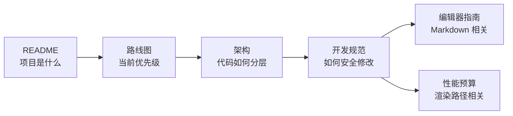

# Papyro 文档

[English](../README.md) | [仓库 README](../../README.zh-CN.md)

这个目录只保留当前有效的文档。旧的阶段性草稿、重复设计说明和一次性调研记录已经合并进下面这些核心文档，避免新人一进来就被历史信息绕晕。

## 从这里开始

| 你想做什么 | 阅读 |
| --- | --- |
| 理解产品方向 | [路线图](roadmap.md) |
| 理解代码结构 | [架构导览](architecture.md) |
| 安全地开始开发 | [开发规范](development-standards.md) |
| 修改 Markdown 编辑器 | [编辑器指南](editor.md) |
| 保持交互性能 | [性能预算](performance-budget.md) |
| 让 AI 快速理解项目 | [AI skills](ai-skills.md) |

## 新人推荐阅读路径

如果你不知道代码该放哪里：

- UI 布局和控件：`crates/ui`
- 用户流程、状态变更、副作用：`crates/app`
- 纯模型和纯规则：`crates/core`
- SQLite、文件系统、workspace 扫描、watcher：`crates/storage`
- 平台对话框和系统集成：`crates/platform`
- Markdown 统计、渲染、协议结构：`crates/editor`
- CodeMirror runtime 行为：`js/src/editor.js` 或 `js/src/editor-core.js`

## 文档维护规则

- README 面向游客和快速启动，不要写成内部设计备忘录。
- [architecture.md](architecture.md) 必须描述当前代码，而不是过期愿景。
- [roadmap.md](roadmap.md) 必须写当前产品和工程优先级。
- [performance-budget.md](performance-budget.md) 必须包含 `scripts/check-perf-docs.js` 检查的所有 trace 名。
- 改动面向贡献者的规则时，中英文文档要同步。
