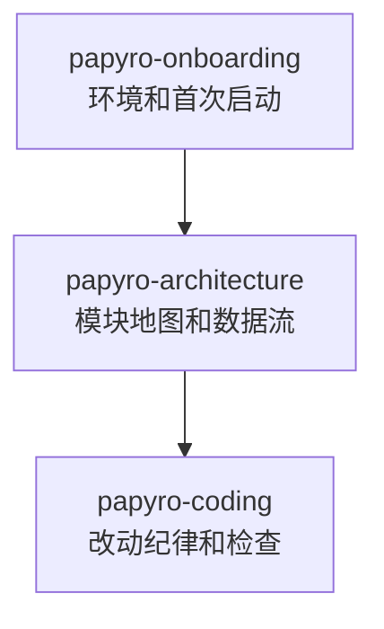

# AI Skills

[English](../ai-skills.md) | [文档首页](README.md)

`skills/` 目录包含项目级 AI 指令。它们短小、聚焦，让 AI coding agent 不必每次都重新读完整仓库。

## 当前 Skills

| Skill | 适用场景 |
| --- | --- |
| `papyro-onboarding` | 安装环境、首次运行、基础检查 |
| `papyro-architecture` | 判断代码属于哪一层、理解数据流 |
| `papyro-coding` | 实现一个小改动并正确验证 |

## 使用路径

## AI Agent 使用规则

1. 只加载和当前任务匹配的 skill。
2. 从 skill 链接到精确文档，不要大范围读历史文档。
3. 按 skill 里的模块边界改代码。
4. 运行 skill 指定的验证命令。
5. 不确定时优先保持改动小而可验证。

## 为什么需要它

Papyro 有多个层：平台宿主、应用 runtime、纯 core、UI、storage、editor helper、JS editor runtime。没有项目级地图时，AI 很容易重复消耗 token 重新理解边界，或者把代码改到错误层。

Skills 能降低这些成本：

- 新人更快安装和跑起来。
- AI 更快找到正确 crate。
- 评审可以引用统一标准。
- 每次任务加载的上下文更少。

## 维护时机

以下情况要更新 skills：

- crate 边界变化。
- 验证命令变化。
- editor 源码/生成物规则变化。
- roadmap 改变主要开发优先级。
- onboarding 步骤变化。
