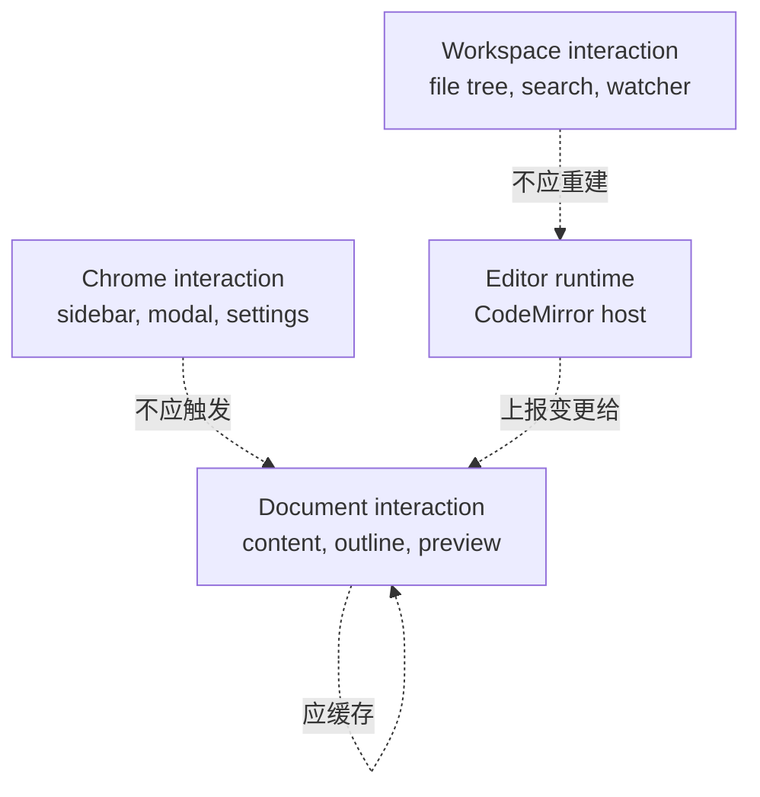

# 性能预算

[English](../performance-budget.md) | [文档首页](README.md)

Papyro 是编辑器，性能是产品质量的一部分，不是功能做完后的优化项。

## 原则

- 输入流畅优先于更复杂的视觉 decoration。
- 切 tab 不应该重建整个 editor shell。
- 侧边栏、主题、设置等 chrome 操作不应该重新计算文档 HTML。
- 大文档要可解释地降级：先暂停昂贵的 live preview 或代码高亮，不能阻塞输入。
- 文件操作不能放进 Dioxus render path。

## 交互预算

| 交互 | 目标 | 说明 |
| --- | --- | --- |
| 普通输入 | 无可感知卡顿 | IME 和 paste 也算输入路径。 |
| 切 tab | 体感低于 100 ms | 尽量复用 editor host。 |
| 切模式 | 体感低于 150 ms | Preview 应使用缓存快照。 |
| 侧边栏折叠/拖拽 | 体感低于 100 ms | 不重建 editor runtime。 |
| 打开小文件 | 体感低于 200 ms | 磁盘读取和 metadata 更新要有边界。 |
| workspace 搜索 | 有渐进反馈 | 大 workspace 不应冻结界面。 |
| Preview 渲染 | 受策略约束 | 大文档可暂停 live preview 或高亮。 |

## Trace 名

CI 会检查这些 trace 名同时出现在本文和 roadmap：

- `perf app dispatch action`
- `perf editor pane render prep`
- `perf editor open markdown`
- `perf editor switch tab`
- `perf editor view mode change`
- `perf editor outline extract`
- `perf editor command set_view_mode`
- `perf editor command set_preferences`
- `perf editor input change`
- `perf editor preview render`
- `perf editor host lifecycle`
- `perf editor host destroy`
- `perf editor stale bridge cleanup`
- `perf chrome toggle sidebar`
- `perf chrome resize sidebar`
- `perf chrome toggle theme`
- `perf chrome open modal`
- `perf workspace search`
- `perf tab close trigger`
- `perf runtime close_tab handler`

## 手工 trace 流程

PowerShell：

```powershell
$env:PAPYRO_PERF = "1"
cargo run -p papyro-desktop
```

操作目标交互，把日志保存到 `target/perf-smoke.log`，然后运行：

```bash
node scripts/check-perf-smoke.js target/perf-smoke.log
```

## Render Path 规则



规则：

- 不在 Dioxus component body 里直接渲染大型 Markdown HTML。
- 不为了更新 chrome clone 大段 tab content。
- Preview、Outline、Tabbar 不订阅无关 raw signal。
- Sidebar、settings、status bar 变化不重建 CodeMirror。
- Hybrid decoration 不在每次输入时无界扫描大文档。

## 大文档策略

降级顺序：

1. 保持 Source 编辑流畅。
2. 文档过大时暂停 live Preview。
3. 先关闭昂贵代码高亮，不阻塞输入。
4. 限制大纲提取。
5. 功能被策略禁用时显示可理解提示。

## UI 和 CSS 预算

- 非生成文件遵守 `node scripts/report-file-lines.js` 的行数预算。
- 重复视觉模式沉淀为 reusable classes 或 components。
- 使用语义 token，避免一次性色值。
- UI 改动后运行：

```bash
node scripts/check-ui-a11y.js
node scripts/check-ui-contrast.js
```
