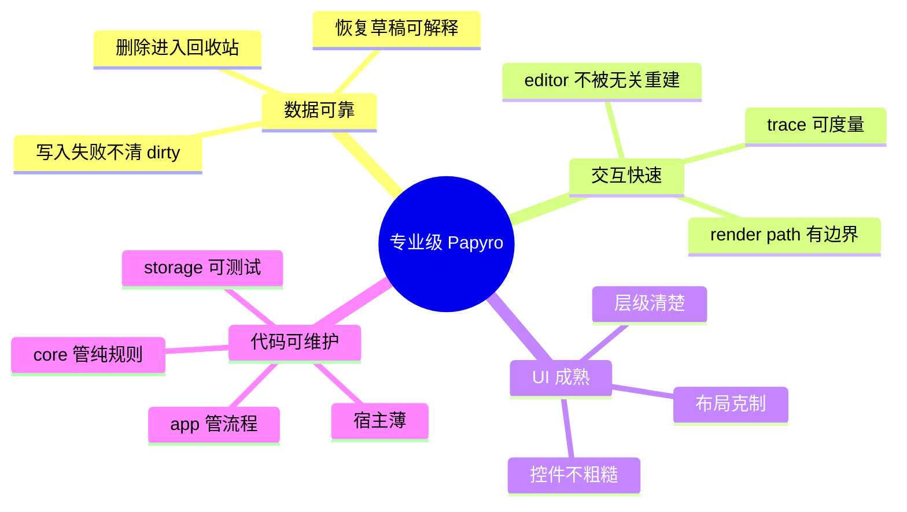
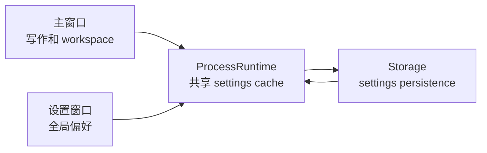
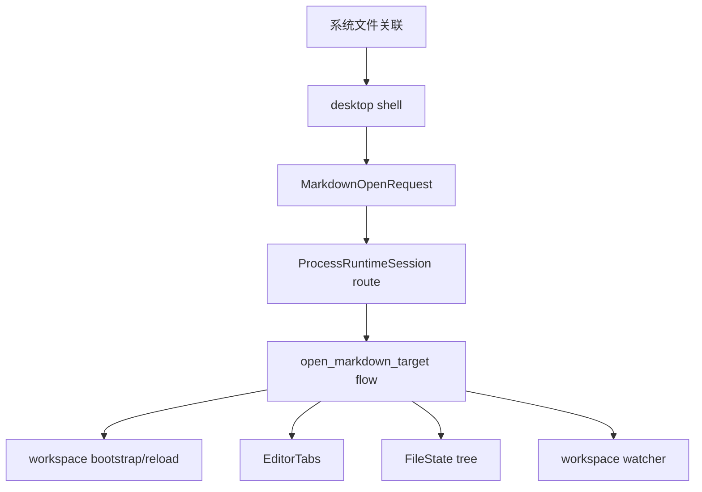

# Papyro 路线图

[English](../roadmap.md) | [文档首页](README.md)

Papyro 的路线图刻意保持聚焦。它应该先成为一个专业的本地优先 Markdown workspace，再考虑成为大型功能平台。

## 产品北极星

Papyro 应该像一个安静、稳定、专业的桌面写作工具：

- 本地 Markdown 文件归用户所有，易备份、同步和迁移。
- Hybrid 模式接近 Typora 的日常写作体验。
- Source 和 Preview 保持可控。
- workspace、tabs、搜索、大纲、回收站、附件、恢复都可预测。
- 启动、切 tab、文件操作和输入在真实项目里保持流畅。
- 架构让新人能理解和继续维护。

## 专业质量标准

## Phase 1 - 基础和数据安全

- [x] 共享 runtime 收进 `crates/app`。
- [x] 平台宿主变薄。
- [x] workspace flow 拆成 use case 模块。
- [x] 保存失败保留 dirty 状态。
- [x] 增加恢复草稿流程。
- [x] 增加 settings 持久化队列。
- [x] 增加 workspace 依赖检查。
- [x] 审计外部文件变化和系统打开 Markdown 文件的保存/冲突路径。
- [x] 把文件关联打开请求做成一等 use case 并补测试。

## Phase 2 - 性能契约

- [x] 增加 editor 和 chrome 交互 trace。
- [x] 增加性能 smoke checker。
- [x] 增加单文件行数预算。
- [x] 增加 UI a11y 和 contrast 检查。
- [x] 保持 editor bundle 生成物同步。
- [ ] 大改 editor 或 chrome 前采集桌面端 trace。
- [x] 给高风险 editor 路径补自动化 smoke。

Trace 名：

- `perf app dispatch action`
- `perf editor pane render prep`
- `perf editor open markdown`
- `perf editor switch tab`
- `perf editor view mode change`
- `perf editor outline extract`
- `perf editor command set_view_mode`
- `perf editor command set_preferences`
- `perf editor input change`
- `perf editor preview render`
- `perf editor host lifecycle`
- `perf editor host destroy`
- `perf editor stale bridge cleanup`
- `perf chrome toggle sidebar`
- `perf chrome resize sidebar`
- `perf chrome toggle theme`
- `perf chrome open modal`
- `perf workspace search`
- `perf tab close trigger`
- `perf runtime close_tab handler`

## Phase 3 - 桌面壳和核心 UX

- [x] 重做桌面 shell 布局。
- [x] 优化侧边栏图标、菜单、根目录选择和空白区域右键行为。
- [x] 移除原生桌面菜单栏。
- [x] 增加中英文 UI 国际化。
- [x] 优化设置界面和暗色模式对比度。
- [x] 替换应用品牌资源。
- [ ] 设置改为独立桌面窗口。
- [x] 设置窗口切换分区时大小稳定。
- [x] 用 Papyro 设计系统组件替换原生感强的 `select`、modal、message、menu、tooltip。
- [x] 建立 `Button`、`IconButton`、`Select`、`SegmentedControl`、`Modal/Dialog`、`Message/Toast`、`ContextMenu`、`Tooltip`、`Tabs`、`FormField` 等基础组件。
- [x] 参考成熟开源组件系统的行为和可访问性，例如 [Radix Primitives](https://github.com/radix-ui/primitives)；参考 [shadcn/ui](https://github.com/shadcn-ui/ui) 的二次封装思路，但不直接引入 React 依赖。
- [ ] 桌面体验稳定后再做移动端布局 pass。

设置窗口目标：

## Phase 4 - Markdown 编辑体验

- [x] 增加 Rust block 分析：标题、列表、表格、代码、数学公式、Mermaid。
- [x] Preview 支持代码高亮和 Mermaid。
- [x] 增加 Hybrid decorations 和 runtime block state。
- [x] 优化粘贴替换和 Markdown 输入命令。
- [x] 增加 Mermaid 渲染/编辑态。
- [ ] 统一 Hybrid selection、cursor hit testing 和 inline decoration 行为。
- [x] 统一代码块、inline code、链接、列表、Mermaid 的选中背景颜色。
- [ ] 把光标错位、命中到错误行、选中背景缺失、意外恢复源码、选区影响空白区域等问题视为 Hybrid 架构级缺陷，而不是零散 CSS bug。
- [x] 继续修补 Hybrid 前先调研行业通用编辑器架构：CodeMirror decorations/widgets、ProseMirror/Tiptap node views、Lexical decorators、Slate void/inline nodes、Typora 类源码/渲染切换策略。见 [Hybrid 编辑器架构评审](editor-hybrid-architecture.md)。
- [x] 在新增更多 Markdown block 能力前，先确定 inline 元素、代码块、表格、公式、Mermaid、链接的稳定 selection 和 hit-testing 策略。
- [x] 为光标定位、文本选中、IME composition、粘贴替换、block 编辑/渲染切换增加回归覆盖或可重复 smoke 脚本。
- [x] 对齐 Typora、飞书文档等现代 Markdown/文档编辑方式，让插入表格、公式、代码块、链接、图片和 Mermaid 足够方便。
- [x] 增加常见 block 的插入入口，不能要求普通用户记住所有 Markdown 语法。
- [x] 表格编辑要文档化：新增行列、单元格导航、对齐、避免布局跳动。
- [x] 数学公式要一等支持：inline/display 插入、实时预览、错误反馈。
- [ ] 以企业级编辑体验为标准：粘贴、撤销、选区、IME、键盘导航、可访问性和布局稳定性都要可靠。
- [ ] 评估 Hybrid 长期是否继续基于 CodeMirror decoration，还是引入更丰富的文档模型。

## Phase 4.5 - 主题、字体和 Markdown 样式

- [x] 定义 theme token：app chrome、editor canvas、Markdown 内容、代码块、selection、focus ring、状态色。
- [x] 先提供少量高质量主题：System、Light、Dark、GitHub-like light/dark、高对比度、暖色阅读主题。
- [x] 采用 Markdown 样式前先调研高认可开源项目，例如 [`sindresorhus/github-markdown-css`](https://github.com/sindresorhus/github-markdown-css)，以及 [Shiki](https://github.com/shikijs/shiki)、[highlight.js](https://github.com/highlightjs/highlight.js)、[Catppuccin](https://github.com/catppuccin/catppuccin) 等代码/主题生态。
- [x] Preview 和 Hybrid 的 Markdown 样式必须一致，标题、列表、表格、引用、代码、数学公式和 Mermaid 不能模式一切换就变样。
- [x] 替换奇怪的字体预设，改成系统优先的实用预设：UI Sans、System Serif、Reading Serif、Mono Code、CJK-friendly fallback stacks。
- [x] 字体设置要面向普通用户：有预览文本、清晰标签、安全默认值，不把冷门字体名放在首选。
- [x] 增加主题和 Markdown 样式 smoke/snapshot 检查，避免后续 CSS 改坏对比度、间距和代码可读性。

## Phase 5 - 文件关联、Tabs 和 Workspace Sessions

目标行为：

- [x] 系统用 Papyro 打开 Markdown 文件时，当前窗口接收文件打开事件。
- [x] Tabs 更新到当前打开的 Markdown 文件。
- [x] 左侧文件树根据打开文件所在目录切换 workspace。
- [x] 多个 tab 属于不同 workspace 时，切换 tab 会同步左侧文件树到当前 tab 的 workspace。
- [x] 切换 workspace context 前保护 dirty tabs。
- [x] watcher subscription 安全跟随 active workspace。
- [x] recent workspace/file 元数据记录该流程。

推荐链路：

## Phase 6 - 多窗口模式

- [ ] 定义生产级 `ProcessRuntime` 和 `WindowSession`。
- [ ] 先把设置做成进程级工具窗口。
- [ ] 在 `NoteOpenMode::MultiWindow` 后面增加 document window routing。
- [ ] 每个窗口独立拥有 tab contents、selection 和 dirty state。
- [ ] storage 和 settings 可安全跨窗口共享。
- [ ] 增加跨窗口保存冲突测试。

多窗口不是简单 UI 功能，它是可靠性功能，不能抢跑。

## Phase 7 - 打包和发布

- [x] 明确 license。
- [ ] 增加桌面端 release packaging。
- [ ] 增加目标平台 app icons。
- [ ] 增加首次启动 workspace onboarding。
- [ ] 增加 release build 手工 QA checklist。
- [ ] README 增加截图或短 demo。
- [ ] 文档化 known limitations。

## 长期原则

- 不新增无助于写作和导航的常驻 chrome。
- 熟悉动作优先图标，破坏性或含义模糊动作使用文本。
- 主编辑区保持安静。
- 数据安全优先于便利。
- 性能预算就是功能要求。
- 架构文档要让新人能做出正确下一步。
