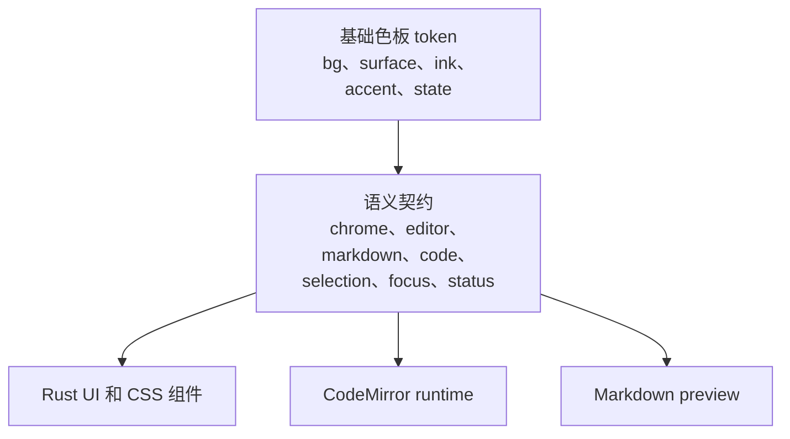

# 主题系统

[English](../theme-system.md)

Papyro 的主题基于语义化 CSS token。组件应该描述“我需要什么语义”，而不是直接写“今天看起来不错的某个颜色”。

## Token 分层

| 层级 | 示例 | 使用者 |
| --- | --- | --- |
| 基础色板 | `--mn-bg`、`--mn-surface`、`--mn-ink`、`--mn-accent` | 主题作者和底层 CSS |
| 应用界面 | `--mn-chrome-bg`、`--mn-chrome-surface`、`--mn-chrome-ink-muted` | 侧边栏、顶部栏、弹窗、命令面板、状态栏 |
| 编辑画布 | `--mn-editor-canvas-bg`、`--mn-editor-canvas-ink`、`--mn-editor-active-line-bg` | CodeMirror host 和源码编辑 UI |
| Markdown | `--mn-markdown-ink`、`--mn-markdown-muted-ink`、`--mn-markdown-link` | Preview 和 Hybrid 渲染后的 Markdown |
| 代码 | `--mn-code-surface`、`--mn-code-block-surface`、`--mn-code-ink`、`--mn-code-border` | 行内代码、代码块、Mermaid 源码编辑区 |
| 选区和焦点 | `--mn-selection-bg`、`--mn-selection-ink`、`--mn-focus-ring` | 文本选区、控件焦点、编辑器光标状态 |
| 状态色 | `--mn-status-danger`、`--mn-status-warning`、`--mn-status-success` | 保存状态、危险操作、警告、成功提示 |

## 源文件

- `assets/main.css` 是共享设计源。
- `apps/desktop/assets/main.css` 是桌面端 runtime 使用的副本。
- `assets/styles/modal.css` 和 `apps/desktop/assets/styles/modal.css` 放弹窗相关样式。
- `js/src/editor-theme.js` 在 CodeMirror 内部消费同一批 token。

如果某个 token 在 app asset 中有副本，同一次提交里必须同步更新。

## 编写规则

- 组件 CSS 优先使用语义 token。写应用界面时用 `--mn-chrome-surface`，不要直接拿 `--mn-surface`。
- Preview 和 Hybrid 的 Markdown 必须共用 `--mn-markdown-*` 和 `--mn-code-*`。
- 不要为了单个组件随手加一个颜色；先判断是否应该补一个语义 token。
- 不要把行为写成颜色名。用 `--mn-status-warning`，不要用 `--mn-yellow`。
- 新增主题前，必须确认 token 覆盖 app chrome、editor canvas、Markdown、代码块、selection、focus ring 和状态色。

## 当前主题

Papyro 当前提供 System、Light 和 Dark。后续增加高质量主题时，优先覆盖基础色板；只有主题确实需要表达不同语义时，才覆盖语义 token。

