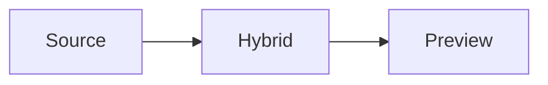

# Tiptap 发布候选 Smoke 检查清单

[English](../tiptap-release-smoke.md) | [Release QA](release-qa.md) | [Tiptap 重构计划](tiptap-refactor-plan.md)

在把 `feat-tiptap` 分支合回主发布线、打发布候选 tag，或者把基于 Tiptap 的桌面构建交给非开发用户之前，必须使用这份清单。

这份清单比通用 [Release QA 检查清单](release-qa.md) 更严格。它专门覆盖 CodeMirror 到 Tiptap 迁移期间最容易回归的编辑器运行时行为。

## 验收记录

完成 smoke 前先填写这一段。

| 字段 | 记录 |
| --- | --- |
| Commit SHA |  |
| 测试人 |  |
| 日期 |  |
| 操作系统和架构 |  |
| 构建命令 |  |
| 构建类型 | Debug / Release |
| 使用的工作区 |  |
| 结果 | Pass / Fail |
| 阻断问题 |  |

## 前置条件

- [ ] 已执行 [开发规范](development-standards.md) 中的自动化基线检查。
- [ ] 确认 `node scripts/check-tiptap-release-smoke.js` 针对发布 fixture 通过。
- [ ] editor bundle 来自当前源码构建，不是过期生成物。
- [ ] 桌面端应用来自上面记录的同一个 commit。
- [ ] 使用一个正常工作区，且至少包含一个已有 Markdown 文件。
- [ ] 保留 devtools 或日志，方便定位 runtime 错误。
- [ ] smoke 前后确认 `git status --short` 没有意外生成物漂移。

## Fixture 文档

创建一个名为 `tiptap-smoke.md` 的 Markdown 笔记。具体文字可以调整，但必须包含这些 block 类型：

- H1、H2、H3 标题。
- 英文和中文段落。
- 粗体、斜体、inline code、删除线和链接。
- 有序列表、无序列表和任务列表。
- 引用和 callout。
- 带语言的 fenced code block。
- 带对齐的 pipe table。
- 行内公式和块级公式。
- Mermaid fenced block。
- 指向本地资源的 Markdown 图片语法。

推荐 fixture：

````markdown
# Tiptap Smoke

中文输入法测试：这是第一段文字，用来验证光标、选区、撤销和粘贴。

## Formatting

This paragraph has **bold**, *italic*, `inline code`, ~~strike~~, and [Papyro](https://github.com/youzi2233/papyro).

- Alpha item
- Beta item
  - Nested item

1. First ordered item
2. Second ordered item

- [ ] Unchecked task
- [x] Checked task

> [!NOTE]
> Callout content should round-trip through Markdown.

```rust
fn main() {
    println!("hello tiptap");
}
```

| Name | Count | Status |
| :--- | ---: | :---: |
| Alpha | 12 | Ready |
| Beta | 3 | Draft |

Inline math: $a^2 + b^2 = c^2$

$$
\int_0^1 x^2 dx = \frac{1}{3}
$$




## Notes

End of document.
````

## 1. Runtime 启动和模式契约

- [ ] 打开 `tiptap-smoke.md`，确认没有出现 `Editor runtime failed`。
- [ ] 确认 tab 标题使用文件名。
- [ ] 依次切换 Source -> Hybrid -> Preview -> Hybrid -> Source。
- [ ] 确认每次切换后内容没有重复、错序或丢失。
- [ ] 确认切换模式后滚动位置仍接近同一段文档区域。
- [ ] 确认 Source 是原始 Markdown，Hybrid 是可编辑富文本，Preview 是只读渲染 HTML。
- [ ] 确认日志中没有 `runtime_error`、panic 或未处理 promise rejection。

## 2. 中文 IME、选区、粘贴和撤销

- [ ] 在 Hybrid 段落中使用中文输入法输入文字。
- [ ] 确认 composition 文字不会提前提交、重复或移动到错误 block。
- [ ] 分别在标题、列表项、任务项和表格单元格中输入中文。
- [ ] 在 Hybrid 中选中一个词并粘贴替换文本。
- [ ] 在 Source 中选中一段文字并粘贴替换文本。
- [ ] 在 Hybrid 中选中文字后粘贴 URL。开启自动链接时，应生成链接。
- [ ] 用快捷键撤销和重做上述每个操作。
- [ ] 确认撤销不会跨越无关模式切换，也不会恢复 smoke 前的旧内容。

## 3. Hybrid Block 控件

- [ ] hover 多个段落和标题。
- [ ] 确认从文字移动到句柄和 `+` 插入入口时，控件保持可触达。
- [ ] 点击 block handle。
- [ ] 确认当前 block 被选中或有明确锚定状态，并打开 block action menu。
- [ ] 使用 block action menu 复制当前 block 为 Markdown。
- [ ] 复制一个 block，并确认副本出现在原 block 后面。
- [ ] 删除刚复制出来的 block，并确认上下文内容不受影响。
- [ ] 点击 `+` 打开插入菜单。
- [ ] 插入 H1、H2、无序列表、有序列表、任务列表、引用、代码块、callout、公式、Mermaid、图片占位和表格。
- [ ] 确认每个新 block 都能立刻编辑，不需要点进隐藏源码 fallback。
- [ ] 拖拽一个 block 到相邻 block 的上方和下方。
- [ ] 确认 drop indicator 跟随指针，最终排序正确。

## 4. 表格编辑

- [ ] 从 slash 搜索插入表格。
- [ ] 从 `+` 菜单的表格尺寸选择器插入另一张表格。
- [ ] 确认可以选择 1x1 到 6x6 的表格尺寸。
- [ ] 编辑多个单元格文字。
- [ ] 用 Tab 和 Shift+Tab 在单元格之间移动。
- [ ] 在单元格内使用方向键，确认光标不会意外跳出表格。
- [ ] 点击行、列和左上角整表 handle。
- [ ] 确认当前选中的行、列或整表有清晰的视觉状态。
- [ ] 使用边缘快捷控件在下方新增行。
- [ ] 使用边缘快捷控件在右侧新增列。
- [ ] 从表格工具栏新增和删除行。
- [ ] 从表格工具栏新增和删除列。
- [ ] 切换表头行和表头列。
- [ ] 对选中单元格应用左对齐、居中和右对齐。
- [ ] 应用和清除单元格背景色。
- [ ] 合并单元格，然后拆分。
- [ ] 在可用时执行表格修复。
- [ ] 通过工具栏删除表格，并确认没有残留句柄。
- [ ] 切到 Source，确认表格仍是合法 Markdown。
- [ ] 再切回 Hybrid，确认表格仍是可编辑表格。

## 5. 公式、Mermaid、图片和代码

- [ ] 在 Hybrid 中编辑行内公式，确认预览或错误反馈会更新。
- [ ] 编辑块级公式，确认非法语法显示可理解错误，不会破坏编辑器。
- [ ] 编辑 Mermaid 源码，确认合法图表能渲染。
- [ ] 制造 Mermaid 语法错误，确认 block 显示错误状态，同时源码仍可编辑。
- [ ] 从剪贴板粘贴图片，确认 Papyro 触发图片粘贴请求路径。
- [ ] 将图片文件拖进 Hybrid，确认图片请求路径保持稳定。
- [ ] 确认 Markdown 图片语法在 Source 中仍可见且可编辑。
- [ ] 编辑 fenced code block 的语言和正文。
- [ ] 确认代码块内容在模式切换后仍保留。

## 6. 大纲和导航

- [ ] 打开大纲面板。
- [ ] 分别在 Source、Hybrid、Preview 中点击每个标题。
- [ ] 确认目标标题立即进入可视区，没有缓慢的 smooth-scroll 延迟。
- [ ] 滚动 Source，确认 active outline heading 更新。
- [ ] 滚动 Hybrid，确认 active outline heading 更新。
- [ ] 滚动 Preview，确认 active outline heading 更新。
- [ ] 把窗口缩窄后再次点击标题。
- [ ] 确认工具栏、大纲开关、状态栏和编辑器内容仍可见。

## 7. 保存、Dirty 状态和恢复安全

- [ ] 修改 fixture，确认 tab 进入 dirty 状态。
- [ ] 保存，确认只有写入成功后 dirty 标记才清除。
- [ ] 将目标文件设为只读，或用其它方式模拟保存失败。
- [ ] 再次编辑并尝试保存。
- [ ] 确认保存失败对用户可见，并且 tab 保持 dirty。
- [ ] 关闭 dirty tab，确认会提示用户，避免丢内容。
- [ ] 未保存编辑后重启，确认恢复草稿说明可理解。

## 8. 系统打开 Markdown 文件和工作区同步

- [ ] 在测试机上将当前构建配置为 Markdown 打开程序。
- [ ] 从当前工作区外部打开一个 `.md` 文件。
- [ ] 确认 Papyro 为该文件打开 tab。
- [ ] 确认侧边栏工作区切换到该文件所在父目录。
- [ ] 再从另一个目录打开一个 `.md` 文件。
- [ ] 在两个 tab 之间切换。
- [ ] 确认侧边栏工作区跟随 active tab。
- [ ] 在其中一个 tab dirty 时重复该流程，确认工作区切换不会静默丢弃编辑。

## 9. 可访问性和键盘路径

- [ ] 在适用范围内用键盘操作 Source、Hybrid、slash menu、block action menu、floating format toolbar 和 table toolbar。
- [ ] 确认 Escape 能关闭浮层且不改变内容。
- [ ] 确认 Enter 能执行当前高亮菜单项。
- [ ] 确认点击外部区域会关闭浮层，但不会清空编辑器内容。
- [ ] 确认菜单动作执行后焦点回到编辑器。
- [ ] 确认控件在英文和中文 UI 中都有可读 label 或 tooltip。

## 10. 编辑器 UI Surface 视觉验收

准备 release candidate 时，为这些 surface 记录桌面截图或短录屏。截图不需要提交进仓库，但 release note 或 QA 记录必须说明检查过哪些视图。

- [ ] Floating toolbar：选中普通段落文字，确认工具栏是不透明 surface、有清晰边框/阴影、按钮节奏接近官方模板，并且没有依赖顶部 shell 的格式化按钮。
- [ ] Link popover：从 floating toolbar 打开链接控件，确认 URL 输入框可读，应用/打开/删除控件同一行对齐，Escape 返回编辑器且不丢内容。
- [ ] Color popover：从 floating toolbar 打开文字颜色，确认 text/highlight 分组是不透明 card surface，label 可读，focus 可见，靠近视口边缘也不裁剪关键动作。
- [ ] Slash menu：输入 `/`，确认菜单是不透明 card，有 active item 状态、分组命令标签、滚动行为、空查询行为，并支持方向键、Enter 和 Escape。
- [ ] Drag handle 和 block menu：hover 段落/标题，确认 handle 和 `+` 入口克制且可触达；打开菜单后确认 Turn into、颜色、适用时的表格动作、duplicate/copy/delete、焦点返还和 destructive 项可辨认。
- [ ] Table handles：hover 表格，确认行/列/单元格 handle、扩展按钮、selection overlay 和 resize handle 不推动布局、不增加空行、不遮挡文本光标。
- [ ] Table cell menu：打开 cell menu 和嵌套 color/alignment 菜单，确认每层不透明、限制在视口内、文本以省略号裁剪、按钮左对齐，长菜单滚动不会改变单元格高度。
- [ ] Image controls：选中本地图片节点，确认左/中/右对齐、caption、download、replace、delete 控件出现在官方 floating toolbar 内，且不破坏本地资源渲染。
- [ ] 窄窗口：在约 900x640 下重复 floating toolbar、slash menu、drag menu 和 table cell menu；关键动作必须可触达，不与 app shell 重叠。
- [ ] 暗色/高对比主题：重复 floating toolbar、slash menu、table cell menu、link/color popover 和 image controls；selected、hover、focus-visible、disabled、destructive 状态必须可区分。

UI-heavy 修复的任务汇报必须包含：检查过的视图、键盘路径、暗色/高对比结果、窄窗口结果、自动化检查和已知 follow-up。

当前自动化覆盖包括 `node scripts/check-desktop-tiptap-webview-smoke.js`：它会启动真实 desktop WebView，并检查 slash menu、floating toolbar、link/color popover、drag context menu、table resize/cell menu、image controls、Source mode 和 Preview mode。它补充但不替代 release candidate 截图验收。

## 11. 通过和失败规则

出现以下任一情况，本轮 smoke 失败：

- 编辑器 runtime 无法挂载。
- Markdown 内容丢失、重复或静默损坏。
- 保存失败却清除了 dirty 状态。
- 中文输入法在常见写作 block 中提交异常。
- Source/Hybrid/Preview 切换导致用户工作丢失。
- 表格编辑留下残留句柄、破坏 Markdown，或单元格不可触达。
- 浮层菜单无法稳定打开、关闭、操作，或不是不透明 bounded surface。
- 表格 hover/resize 增加空行、行高异常跳变，或破坏文本光标命中。
- Link/color/image 控件透明、被裁剪、不可读，或让编辑器选区丢失。
- 系统打开文件不能同步 tab 和工作区上下文。

失败时：

- [ ] 记录准确章节和步骤。
- [ ] 保存日志或截图。
- [ ] 如果 fixture 能复现内容损坏，保留该文件。
- [ ] 继续发布工作前，新建聚焦 issue 或任务。
- [ ] 失败步骤在后续运行中通过之前，不要把迁移标记为完成。
