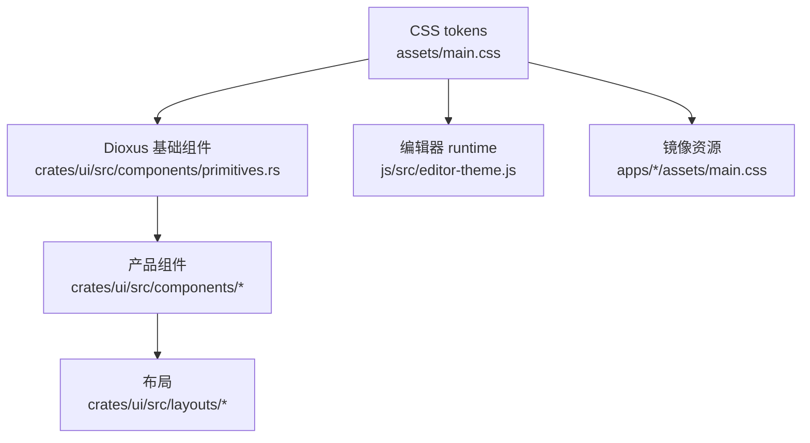

# UI 架构与组件盘点

[English](../ui-architecture.md) | [文档首页](README.md)

这份文档说明 Phase 3.5 重构期间 Papyro UI 应该如何组织。它和 [UI/UX 对标与改版决策](ui-ux-benchmark.md)、[Papyro UI 视觉 Brief](ui-visual-brief.md)、[UI 信息架构](ui-information-architecture.md)、[UI 界面审计](ui-surface-audit.md)、[主题系统](theme-system.md) 配套使用。

## 归属模型

规则：

- `assets/main.css` 是共享视觉源。
- `apps/desktop/assets/main.css` 和 `apps/mobile/assets/main.css` 是运行时副本，CSS 改动时必须同步。
- `crates/ui/src/components/primitives.rs` 拥有可复用 Dioxus 控件。
- 产品组件组合基础组件，不应该重新发明控件行为。
- layout 模块负责排列产品区域，不拥有按钮、菜单或表单字段样式。
- `js/src/editor-theme.js` 使用同一批 CSS token 来服务 CodeMirror 和 Hybrid 渲染。

## 当前组件盘点

| 区域 | 当前组件 | 说明 |
| --- | --- | --- |
| 基础组件 | `Button`、`IconButton`、`Select`、`Dropdown`、`SegmentedControl`、`Tabs`、`Modal`、`Menu`、`ContextMenu`、`MenuItem`、`Tooltip`、`Message`、`StatusStrip`、`StatusMessage`、`StatusIndicator`、`FormField`、`Toggle`、`Slider`、`TextInput`、`ResultRow`、`SettingsLayout`、`SettingsNav`、`SettingsRow`、`DialogSection`、`TreeItemButton`、`TreeItemEditRow`、`EmptyState` | 已经有基础，但还需要更强的状态契约、variant、键盘行为和文档。 |
| App chrome | `Sidebar`、`FileTree`、`AppHeader`、`StatusBar`、`DesktopLayout`、`MobileLayout` | 文件树行已经使用 `TreeItem` 基础组件承载视觉状态；侧边栏 footer/workspace 行还需要共享 `SidebarItem`。 |
| 编辑器 | `EditorPane`、`EditorChrome`、`EditorTabButton`、`OutlinePane`、`PreviewPane`、`EditorHost`、`FallbackEditor` | 需要稳定 chrome 分区、tab overflow 规则、大纲行为和共享 Markdown 视觉 token。 |
| 弹窗界面 | `SettingsModal`、`QuickOpenModal`、`CommandPaletteModal`、`SearchModal`、`TrashModal`、`RecoveryDraftsModal`、`RecoveryDraftCompareModal` | 应共享 dialog shell、结果行、空状态、加载态和键盘焦点行为。 |
| 设置 | `SettingsSurface`、`TagManagementSection`、`TagEditorRow`、`AboutMetaItem` | 设置页已经组合共享导航、面板、表单行和 section 基础组件；标签管理还需要更丰富的行组件。 |
| 搜索/命令 | `ResultRow`、`CommandPaletteRow`、`QuickOpenRow`、`SearchResultRow`、`HighlightedText` | 命令、快速打开和搜索结果已经共享行壳；下一步补图标、快捷键、更丰富元信息和分组状态。 |
| 恢复/回收站 | `RecoveryDraftRow`、`RecoveryComparePanel`、`TrashNoteRow` | 应复用未来 list-row 和危险动作 pattern。 |

## 目标基础组件

| 基础组件 | 状态 | 需要补齐 |
| --- | --- | --- |
| `Button` / `ActionButton` | 部分已有 | `ActionButton` 已支持复用图标和 loading/disabled 状态；下一步补尺寸 variant 并迁移剩余原生按钮。 |
| `IconButton` | 已有 | 增加 selected/current、disabled、destructive、compact 和 tooltip placement。 |
| `Input` / `TextInput` | 部分已有 | 收敛成一个组件族，支持 label、error、disabled、inline action。 |
| `Select` | 已有 | 增加键盘导航、必要时支持 option group、增加尺寸 variant。 |
| `SegmentedControl` | 已有 | 继续用于主题、视图模式等小枚举；必要时支持 disabled option。 |
| `Switch` | 以 `Toggle` 形式存在 | 重命名或 alias 为 `Switch`；文档化 checked、disabled、focus-visible。 |
| `Dialog` / `Modal` | 部分已有 | `DialogSection` 已覆盖设置页重复 section；modal shell 还需要稳定尺寸和焦点管理。 |
| `Popover` | 缺失 | 用于插入菜单、紧凑设置提示和编辑器 affordance。 |
| `DropdownMenu` | 通过 `Menu` 部分存在 | 补 trigger、对齐、键盘行为、分割线、图标和快捷键。 |
| `ContextMenu` | 已有 | 保留为 menu shell；和 dropdown menu 共享 item model。 |
| `Tooltip` | 已有 | 如果 CSS-only tooltip 不够，再补 placement 和 delay 策略。 |
| `Toast` / `Message` / `StatusStrip` | 部分已有 | `StatusStrip` 已拥有 footer 状态栏布局；transient toast 仍需要单独 primitive。 |
| `Tabs` | 已有 | 区分 segmented tabs 和文档 tab bar。 |
| `SidebarItem` | 缺失 | 统一侧边栏按钮、workspace row 和导航 row。 |
| `TreeItem` | 部分已有 | `TreeItemButton`、`TreeItemEditRow` 和 `TreeItemLabel` 已拥有文件/文件夹图标、展开态、选中/编辑/拖拽/放置 class 和行标签布局；键盘模型和右键菜单作用域仍在文件树代码里。 |
| `Toolbar` / `ToolbarZone` | 部分已有 | `EditorToolbar` 和 `ToolbarZone` 已包住编辑器 chrome 的弹性 tabs 区和固定工具区；split panes、可调整 rail 和通用滚动容器还需要继续接入。 |
| `EmptyState` | 已有 | 增加 compact、onboarding、error 和 action variant。 |
| `Skeleton` | 缺失 | 服务 workspace 加载、搜索加载和未来异步窗口。 |
| `InlineAlert` / `ErrorState` | 部分已有 | `InlineAlert` 已用于预览提示和命令/搜索空态；较大的阻断错误仍需要 `ErrorState`。 |
| `SettingsLayout` / `SettingsRow` | 部分已有 | 设置导航、面板、section 和行已经进入基础组件；helper text、错误态和更丰富的表单状态还需要继续接入。 |

## 产品 Pattern

重构更多界面前，先用基础组件建立这些 pattern：

| Pattern | 使用位置 | 契约 |
| --- | --- | --- |
| `SettingsRow` | 设置、未来偏好设置窗口 | 一列表单：label、可选 description、control、未来 helper/error slots。 |
| `ResultRow` | 搜索、快速打开、命令面板 | 图标、主文本、次文本、元信息、高亮、键盘 current 状态。 |
| `TreeRow` | 文件树 | 缩进、展开图标、文件/文件夹图标、selected/editing/drag/drop 状态、右键菜单、键盘目标。 |
| `ToolbarZone` | 编辑器 chrome、app header | 固定或弹性区域，并显式定义 overflow 行为。 |
| `DialogSection` | 设置、恢复、回收站 | 标题、正文、可选 footer、稳定间距。 |
| `InlineStatus` / `StatusStrip` | 保存状态、预览策略、错误、footer 状态栏 | tone、图标/文本、紧凑布局、可访问 role。 |

## CSS Token 规则

使用这些 token 分层：

- 基础色板：`--mn-bg`、`--mn-surface`、`--mn-ink`、`--mn-accent`。
- 语义 token：`--mn-chrome-*`、`--mn-editor-*`、`--mn-markdown-*`、`--mn-code-*`、`--mn-selection-*`、`--mn-status-*`。
- 组件 token：只有基础组件需要稳定契约时才新增，例如 `--mn-button-pad` 或 `--mn-tabbar-min-height`。

大范围 UI 改动中禁止：

- 在组件 CSS 里写裸 hex，palette/theme 定义除外。
- 重复现有 token 的一次性间距。
- 只适配浅色模式的组件样式。
- 页面 section 使用 card 套 card。
- 新 class 绕过现有基础组件。

允许的一次性 CSS：

- 单个产品界面的布局胶水。
- 在本文或 roadmap 中记录过的临时迁移 class。
- 现有基础组件确实表达不了的视觉规则，但后续必须提出 primitive 方案。

## 迁移顺序

1. **设置行：** 继续基于 `SettingsRow`、`DialogSection`、`SettingsNav`、`Switch`、`Select`、`SegmentedControl` 推进；下一步补 helper/error slots 并迁移标签行。
2. **结果行：** 对齐命令面板、快速打开和搜索结果行。
3. **文件树行：** 继续基于 `TreeItemButton` 和 `TreeItemEditRow` 推进；下一步补 focus/current variants，并共享带作用域的菜单 item model。
4. **编辑器 chrome：** 继续基于 `EditorToolbar` 和 `ToolbarZone` 完善 tab overflow、模式切换、大纲按钮和未来更多菜单规则。
5. **空/加载/错误态：** 继续扩展新的 `InlineAlert` pattern，并在下一个大范围异步 UI 前补 `Skeleton`、`ErrorState`。
6. **Markdown surface：** 等 Hybrid selection 和 hit testing 稳定后，再统一 Markdown token。

## Review Checklist

合并 UI 改动前检查：

- 是否优先使用了现有基础组件？
- 浅色、深色、高对比状态是否覆盖？
- 键盘焦点是否可见且可到达？
- 窄窗口下主要操作是否仍可达？
- 生成/镜像 CSS 是否同步？
- 组件规则变化时，相关文档是否更新？
- 提交是否只聚焦一个界面或一个基础组件族？
