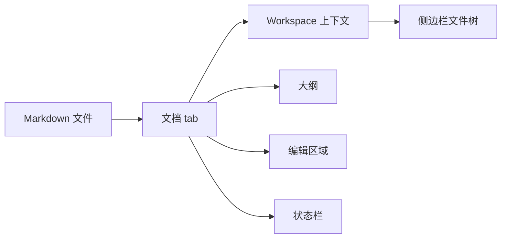
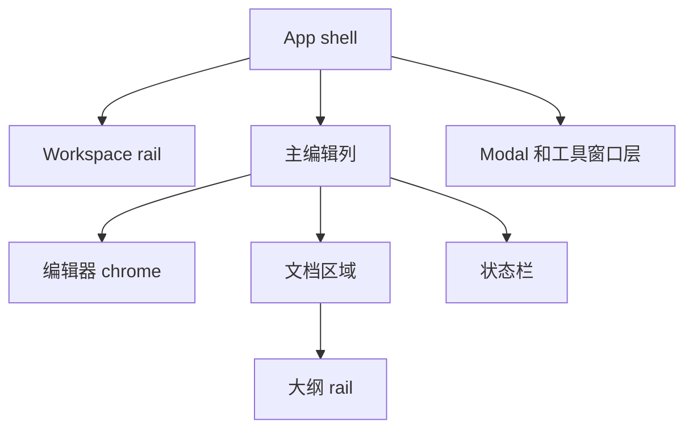
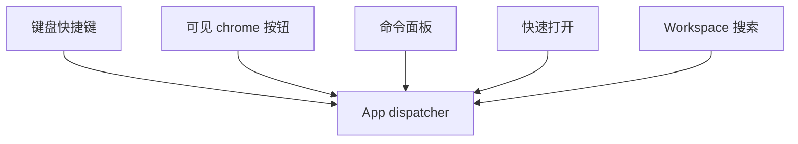
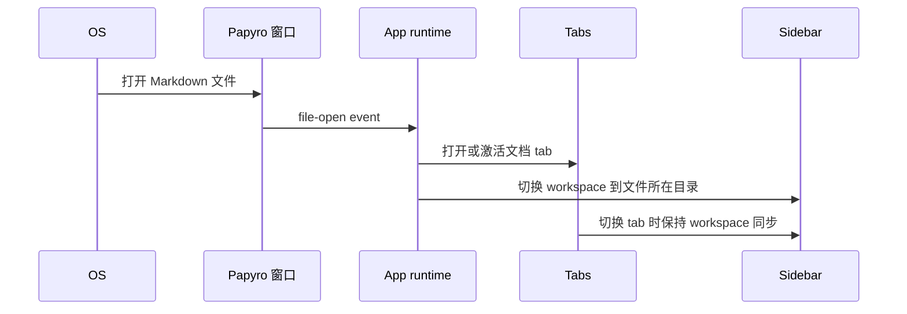

# UI 信息架构

[English](../ui-information-architecture.md) | [文档首页](README.md)

这份文档定义 Phase 3.5 UI/UX 重构中，Papyro 的主要产品界面应该如何相互协作。它连接 benchmark、视觉 brief 和组件盘点：

- [UI/UX 对标与改版决策](ui-ux-benchmark.md) 定义质量标尺。
- [Papyro UI 视觉 Brief](ui-visual-brief.md) 定义气质、间距、色彩角色和动效。
- [UI 架构与组件盘点](ui-architecture.md) 定义可复用 Dioxus 基础组件和 CSS token 归属。

目标是停止把侧边栏、编辑器、大纲、命令、搜索、设置和工具窗口当成互不相关的页面。它们应该组成一个连贯的桌面 workspace。

## 产品模型

Papyro 有四类核心信息对象：

| 对象 | 含义 | UI 归属 |
| --- | --- | --- |
| Workspace | 给笔记提供本地上下文的文件夹树。 | 侧边栏和 workspace flows |
| Document | 一个 Markdown 文件、dirty 状态、视图模式、大纲和编辑器 runtime。 | 编辑器面板和 tabs |
| Command | 可以从 UI chrome、快捷键或命令面板触发的用户动作。 | 命令面板和 app dispatcher |
| Preference | 语言、主题、字体、编辑器行为等全局配置。 | 设置窗口 |

活跃文档拥有活跃 workspace 上下文。当一个 tab 指向另一个 workspace 里的文件时，切换到这个 tab 应该让侧边栏同步到对应 workspace。这样既保持本地优先，也不强迫所有打开笔记必须属于一个全局文件夹。

## 工作台壳

当前代码：`DesktopLayout` 在 `.mn-shell` 里渲染 `Sidebar`、`EditorPane`、`StatusBar` 和各种 modal。

目标架构：

规则：

- 侧边栏是 workspace navigator，不能变成杂项命令面板。
- 主编辑列是写作界面，拥有 tabs、视图模式、大纲开关、文档区域和状态栏。
- 状态栏属于主编辑列下方，不属于侧边栏。
- Modal 在 app shell 之上。设置后续应改成进程级独立工具窗口。
- 在视觉细化前，必须先明确窄窗口布局规则。

## 侧边栏信息架构

侧边栏回答三个问题：

1. 当前 workspace 是哪个？
2. 当前有哪些文件和文件夹？
3. 当前目标允许哪些操作？

目标分区：

| 分区 | 作用 | 说明 |
| --- | --- | --- |
| 品牌行 | App 识别、主题快捷入口、设置入口。 | 保持紧凑，不加第二行口号。 |
| 搜索入口 | Workspace 搜索。 | 禁用时要说明需要先打开 workspace。 |
| Workspace 根目录 | 当前目录路径和根目录选中目标。 | 点击文件树空白区域应回到根目录选中。 |
| 文件树 | 文件、文件夹、展开态、选中目标、右键菜单。 | 文件、文件夹、空白区域菜单必须分场景。 |
| 侧边栏底部 | 低频 workspace 操作。 | 需要强化语义时使用 icon + 文字。 |

右键菜单规则：

| 目标 | 允许操作 | 不允许操作 |
| --- | --- | --- |
| Workspace 根目录 | 新建笔记、新建文件夹、在系统中显示/打开、刷新。 | 重命名根目录、删除根目录。 |
| 文件夹 | 新建笔记、新建文件夹、重命名、删除、在系统中显示/打开。 | Markdown 文件专属动作。 |
| Markdown 文件 | 打开、重命名、删除、显示所在目录。 | 创建子文件夹。 |
| 文件树空白区域 | 选中 workspace 根目录、在根目录新建笔记、在根目录新建文件夹、刷新。 | 重命名、删除、文件专属动作。 |

## 编辑器头部信息架构

编辑器头部必须稳定拆成两个大区域：

规则：

- 左侧区域是弹性和可滚动区域。它可以缩小、滚动，但不能把右侧操作区顶出视口。
- 右侧区域是固定可达区域。视图模式和大纲是主操作。
- Tab 溢出只发生在 tab bar 内部横向滚动。
- 长文件名必须在 tab button 内截断，不能撑开整个 toolbar。
- Source、Hybrid、Preview 必须共享同一个文档身份和大纲模型。

## 文档区域信息架构

文档区域有三种模式：

| 模式 | 用户预期 | 信息架构规则 |
| --- | --- | --- |
| Source | 准确编辑 Markdown 源码。 | CodeMirror 是交互真相来源。 |
| Hybrid | 以接近渲染结果的方式写 Markdown。 | selection、cursor hit testing 和 block 生命周期属于架构级问题。 |
| Preview | 只读渲染和文档导航。 | 点击用于链接或大纲跳转，编辑控件不进入画布。 |

Hybrid 和 Preview 默认不应该展示源码式行号，因为渲染后的 block 高度和源码行高不一致。若诊断场景需要行号，后续应作为明确的开发者或高级设置暴露。

## 大纲信息架构

大纲是文档导航，不是装饰面板。

规则：

- 宽度要能容纳真实标题，略宽于当前过窄 rail。
- 点击条目直接跳到目标标题。平滑滚动不是必要项，不能拖慢导航。
- Source、Hybrid、Preview 都应该根据滚动位置更新 active heading。
- 点击大纲后，被点击标题应该立即变成 active。滚动观察器可以后续修正，但不能短暂高亮上一个标题。
- 窄窗口下，大纲应折叠成 popover 或 overlay，而不是留下一个看似可点但无响应的隐藏面板。

## 命令、搜索和快速打开

这些界面都是进入同一套 app model 的效率路径。

规则：

- 命令面板、快速打开、搜索结果应共享 `ResultRow` 密度、焦点、图标、高亮和元信息样式。
- 空状态、加载态和错误态应使用共享基础组件，而不是各自写一段临时文本。
- 同一个 command 在不同入口出现时，应使用同一个语义标签。
- 键盘焦点必须可预测：打开 modal 后聚焦搜索框或第一个有意义控件；关闭后尽量回到触发入口。

## 设置信息架构

设置是全局偏好。之前可见的全局/工作区设置拆分会增加普通用户理解成本，因此 UI 上只保留全局设置。

目标分区：

| 分区 | 作用 |
| --- | --- |
| 通用设置 | 语言、主题、编辑器字体、粘贴行为、自动保存延迟。 |
| 关于 Papyro | 版本、license、本地优先承诺、常用链接。 |

规则：

- 切换设置分区时，窗口大小必须稳定。
- 打开设置时，语言和主题控件必须反映当前全局状态。
- 同一个面板里，控件要么即时生效，要么等待保存按钮。不要在没有明确文案的情况下混用。
- 主题选项少时用 segmented control。语言后续可能扩展，所以用 select。
- 未来独立设置窗口中，国际化、主题、图标和初始 shell 要在显示窗口前加载，避免白屏闪烁和 Dioxus 默认标识。

## 多窗口和文件关联信息架构

未来文件关联行为：

规则：

- 系统打开 `.md` 文件时，应尽量激活已有窗口。
- 目标文件成为一个 tab。
- 文件所在目录成为这个 tab 的活跃 workspace。
- 如果打开的 tab 属于不同目录，切换 tab 时同步侧边栏上下文。
- workspace context 变化前必须保护 dirty tabs。

## 响应式信息架构

窗口变窄时要有明确降级：

| 压力来源 | 预期行为 |
| --- | --- |
| 侧边栏和编辑区变紧 | 侧边栏在 min/max 规则内缩小或折叠。 |
| Tab bar 溢出 | Tabs 在左侧 toolbar 区域内部横向滚动。 |
| 编辑器工具区空间不足 | 保持视图模式和大纲可达，低优先级动作进入 overflow。 |
| 大纲放不下 | 使用 overlay 或 popover，不留下无效隐藏面板。 |
| 状态栏溢出 | 在主编辑列内换行或紧凑化，不能挤出视口。 |
| 设置内容变化 | 窗口尺寸不变，内容区内部滚动。 |

## 实现顺序

1. 把这份信息架构落成布局基础组件：`AppShell`、`WorkspaceRail`、`EditorToolbar`、`ToolbarZone`、`ScrollContainer`、`ResponsiveOverflow`。
2. 基于稳定的 `Dialog`、`SettingsRow`、`SegmentedControl`、`Select` 和 `Button` contract 重做设置页。
3. 用固定左右 toolbar 区域和 tab overflow 测试重做编辑器 chrome。
4. 把文件树行抽成可复用 `TreeItem` pattern，并支持分场景菜单。
5. 让命令面板、快速打开和搜索共享同一个 `ResultRow` pattern。
6. 增加宽屏、窄窗口、暗色模式、设置分区切换、tab 溢出和大纲行为的设计 QA 截图。

## 验收清单

- 每个可见区域都有明确名称和职责。
- 同一个动作在不同位置出现时，标签、图标和状态一致。
- 窄窗口下主要操作仍可达。
- 侧边栏上下文跟随活跃 tab。
- Source、Hybrid、Preview 中的大纲都能作为文档导航使用。
- 设置切换分区时窗口尺寸不跳动。
- 搜索、快速打开、命令面板共享同一套交互语法。
- 新增一次性 CSS 默认不允许，除非先在 UI 架构文档中写清迁移原因。
