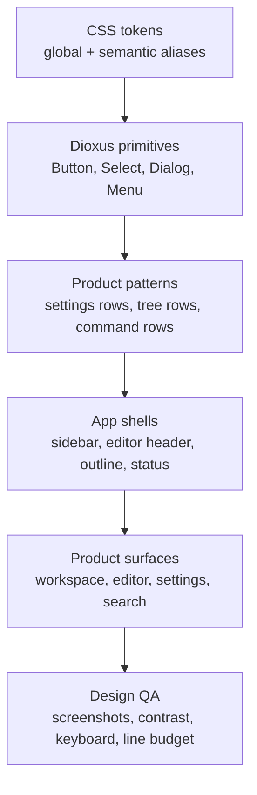

# UI/UX 对标与改版决策

[English](../ui-ux-benchmark.md) | [文档首页](README.md)

这份文档把 Phase 3.5 路线图拆成可执行的设计决策。它不是要求照抄任何产品。Papyro 应该学习成熟写作工具的经验，同时保留自己的定位：本地优先 Markdown、安静的桌面写作、快速 workspace 导航，以及可预测的数据归属。

调研日期：2026 年 5 月 2 日。

## 参考对象

| 参考对象 | 为什么参考 | 公开来源 |
| --- | --- | --- |
| 飞书/Lark Wiki | 企业知识库，强调富文档、搜索、权限和迁移流程。适合参考信息架构和专业密度。 | [Lark Wiki](https://www.larksuite.com/en_us/product/wiki) |
| 语雀 | 中文知识库产品，强调专业文档编辑器和结构化知识库。适合参考中文用户对知识工具的预期。 | [语雀空间](https://www.yuque.com/about/groups) |
| Notion | block-first 写作界面、行内格式菜单、slash command、模板、数据库和拖拽组织。适合参考插入入口和 block 操作。 | [Writing and editing basics](https://www.notion.com/help/guides/writing-and-editing-basics) |
| Obsidian | 本地 Markdown 模型，区分 Reading、Source 和 Live Preview。适合参考 Papyro 的 Source/Hybrid/Preview 关系。 | [Views and editing mode](https://obsidian.md/help/edit-and-read) |
| Typora | Markdown-native 写作体验，表格源码自动生成，支持公式、图表和低摩擦 WYSIWYM。适合参考 Hybrid 编辑预期。 | [Markdown Reference](https://support.typora.io/Markdown-Reference/)、[Draw diagrams](https://support.typora.io/Draw-Diagrams-With-Markdown/) |
| Fluent 2 | 成熟 token 模型、可访问性基线和跨平台语义。适合参考 token 命名、主题和对比度规则。 | [Design tokens](https://fluent2.microsoft.design/design-tokens)、[Accessibility](https://fluent2.microsoft.design/accessibility) |
| Radix/shadcn | 适合参考组件状态和本地拥有组件源码的模式。Papyro 应该学习架构思想，不引入 React 依赖。 | [Radix Primitives](https://www.radix-ui.com/primitives/docs/overview/introduction)、[shadcn components](https://ui.shadcn.com/docs/components) |

## 产品方向

Papyro 应该像安静、专业的桌面编辑器，而不是 Web dashboard，也不是营销页。

设计原则：

- **本地优先的确定感：** 文件位置、保存状态、恢复、回收站和 workspace 根目录必须始终可理解。
- **克制的信息密度：** 工具可以多，但界面不能乱。优先使用紧凑结构、清晰对齐和克制色彩。
- **写作优先：** chrome 服务写作，但不能和文档内容抢注意力。
- **模式可预测：** Source、Hybrid、Preview 应该有明确差异，同时共享排版、选区颜色和 Markdown 渲染规则。
- **键盘路径完整：** 命令面板、快速打开、block 插入、大纲跳转、搜索和 tab 切换不能只依赖鼠标。
- **组件所有权清晰：** Dioxus 组件负责行为和状态，CSS token 负责视觉语言，一次性 CSS 只能作为最后选择。

## 对比矩阵

| 界面 | 参考信号 | Papyro 当前差距 | 改版决策 |
| --- | --- | --- | --- |
| Workspace 导航 | 飞书/Lark 和语雀把知识空间当成组织系统，Obsidian 保持本地文件显性。 | 侧边栏已经优化过，但层级、密度模型和根目录说明还不够系统。 | 把侧边栏当作稳定的 workspace navigator：根目录摘要、文件树、范围化操作、搜索入口和上下文空状态都走同一套视觉规则。 |
| 编辑器头部 | 现代编辑器会把文档操作放近，但保持安静。Notion 和 Obsidian 都不会让工具压过写作区。 | 头部操作经历多次补丁，仍然有拼装感。 | 头部拆成稳定区域：文档身份、tab overflow、视图模式、大纲、更多操作。每个区域都要有固定响应式规则。 |
| Markdown 模式 | Obsidian 区分 Reading、Source、Live Preview；Typora 让编辑接近渲染结果。 | Hybrid 仍有光标、命中和源码显隐问题。 | Hybrid 质量是架构问题。selection、pointer 语义和 block 生命周期稳定前，不继续只做视觉粉饰。 |
| Block 插入 | Notion 用 slash command 和上下文菜单；Typora 会生成表格源码。 | Papyro 已有插入入口，但还不是完整写作流。 | 建立统一插入面板：标题、列表、表格、代码、公式、Mermaid、图片、链接、callout、分割线。 |
| Markdown 渲染 | Typora 和 Obsidian 重视标题、列表、代码、表格、公式、图表和 callout 的可读性。 | Preview 和 Hybrid 样式已经改善，但还需要更强的编辑排版体系。 | 建立 Markdown 样式 token：block 间距、标题节奏、表格密度、代码背景、callout accent、选区 overlay。 |
| 大纲 | 企业级文档把大纲当导航，而不是装饰。 | 大纲已经可点击，但响应式和 active section 精度仍然敏感。 | 大纲做成导航组件：固定宽度、active 规则、键盘导航和小窗 fallback。 |
| 设置 | Fluent 类系统按用户任务分组，并保持面板稳定。 | 设置已优化，但过去存在布局跳动和控件状态不一致。 | 设置使用固定 shell、左侧 rail、一列表单行；少量枚举用 segmented control，并绑定实时全局状态。 |
| 搜索和命令面板 | 成熟工具把搜索和命令作为高频效率路径。 | 搜索和命令已有，但交互语法不够统一。 | 搜索、快速打开、命令共享行样式、高亮、键盘焦点、空状态、加载状态和结果元信息。 |
| 空/加载/错误态 | 企业 UI 会把这些当产品体验，而不是 fallback 文本。 | 一些状态仍然像工程输出。 | 增加 `EmptyState`、`Skeleton`、`InlineAlert`、`ErrorState` 基础组件和产品文案规则。 |
| 主题和色彩 | Fluent 使用语义 token，并支持浅色、深色、高对比和品牌变体。 | 已有 token，但旧的一次性色值仍可能泄漏到界面里。 | 采用 global token + semantic alias：canvas、chrome、control、border、text、accent、danger、warning、success、selection、focus。 |
| 组件状态 | Radix 和 shadcn 展示了清晰 parts、variants、focus、disabled 和键盘状态。 | 部分组件已是 Papyro 风格，但系统还没有完全文档化成 API。 | 建立并记录 Dioxus primitives，组件必须有命名 variant 和必要状态覆盖。 |
| 窄窗口 | 桌面工具在窗口变窄时仍保持主要操作可达。 | Papyro 过去多次出现 overflow 回归。 | 先定义 app-shell overflow contract：tab scroller、操作区、大纲折叠、侧边栏最小宽度、状态栏换行。 |

## 建议的 UI 架构

改版顺序：

1. **设计 brief：** 定义气质、字体、间距、色彩角色、图标、动效和密度。
2. **Token 清理：** 清除 app chrome 和 editor surface 中漂移的裸色值、裸间距。
3. **基础组件：** 先强化可复用控件，再改每个界面。
4. **界面改版：** 一次只改一个产品界面，优先设置和编辑器 chrome，因为它们最容易暴露组件缺陷。
5. **Markdown 改版：** 等编辑器行为 contract 稳定后，再统一 Preview 和 Hybrid。
6. **QA 检查：** 补改版前后、窄窗口、暗色模式、对比度和键盘路径检查。

## Papyro 的明确决策

- 采用 **disciplined utility** 气质：安静、准确、带一点编辑排版感，用颜色表达状态和方向，而不是装饰。
- App 内部不要出现 hero 式大块装饰。Papyro 是反复使用的生产力工具。
- 设置页优先一列表单。像主题这种小枚举用 segmented control，语言这种未来可能扩展的选项用 select。
- 浅色主题下，文档画布保持白色或接近白色，app chrome 用轻微层级分隔。
- 文件树行和命令行共享密度、focus ring、图标尺寸和 selected-state 逻辑。
- 高频动作使用图标，但危险或语义不明确的动作要配文字。
- 菜单、popover、dialog 都是一等组件，必须支持键盘和焦点行为。
- Preview 和 Hybrid 的 Markdown 排版必须通过共享 token 同步。
- 新增基础组件前先写进 UI 架构文档，再大面积使用。

## 立刻跟进的任务

- [ ] 创建 `docs/ui-visual-brief.md` 和 `docs/zh-CN/ui-visual-brief.md`。
- [ ] 盘点现有 Dioxus 组件，并映射到目标基础组件清单。
- [ ] 增加 CSS token 审计：裸色值、一次性间距、重复组件 selector。
- [ ] 以设置页作为第一个受控界面，用新基础组件规则重做。
- [ ] 以编辑器 chrome 和 tab overflow 作为第二个受控界面重做。
- [ ] 在手工 UI smoke checklist 中加入窄窗口和暗色模式截图。
