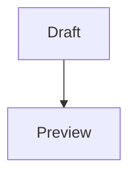

# Hybrid 标题

Paragraph with **bold**, *emphasis*, [link](https://example.test), `code`, and $x^2$.

- [ ] Draft task
- [x] Reviewed task
1. Ordered item

> Quote with **formatting**.

```rust
fn main() {
    println!("hello hybrid");
}
```

| Name | Status |
| --- | :---: |
| Alpha | Ready |
| Beta | Waiting |


$$
E = mc^2
$$


